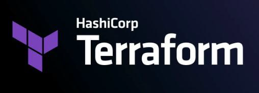
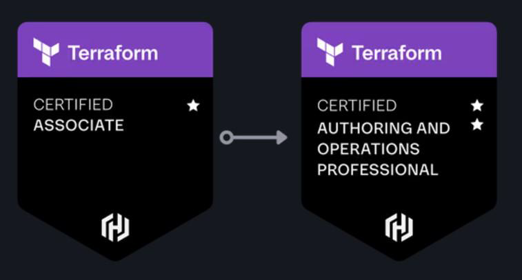

# Overview of Terraform Certification

Terraform has become one of the most popular and widely used tools for
creating and managing infrastructure, and a de facto IaC tool for DevOps.
HashiCorp has introduced an official Terraform certification designed to validate
students' knowledge and skills in core Terraform concepts.

## What Does this Course Cover?

We start this Terraform course from absolute scratch. Once core concepts are
covered, we move on to advanced topics.
We cover ALL the topics of the official exams.

# Long Term Vision

Due to immense popularity, HashiCorp has also released a Terraform
Professional certification.
A long, difficult, practical-based exam of 4 hours
We launched the first Terraform Professional certification course in the world.

### Hashicorp certification

<https://www.hashicorp.com/en/certification>

# Exploring Exam BluePrint

## Understanding the Basics

This is a certification specific course and we cover all the pointers that are part
of the official exam blueprint.

| Item                  | Details |
|-----------------------|---------|
| Assessment Type        | Lab-based and multiple choice |
| Format                | Online proctored |
| Duration              | 4 hours; 15‑min break included |
| Price                 | $295 USD, plus locally applicable taxes and fees. Includes free retake. |
| Language              | English |
| Credential Expiration | 2 years |
| Keyboard              | US QWERTY only (contact <certifications@hashicorp.com> for other languages or layouts) |

The arrangement of topics in this course is a little different from the exam
blueprint to ensure this course remains beginner friendly and topics are covered
in a step by step manner.

### Terraform Associate (004) details

<https://developer.hashicorp.com/certifications/infrastructure-automation>

## About the Course and Important Resources

This is a certification specific course and we cover all the pointers that are part
of the official exam blueprint.
This course follows practical based approach.
The course will be lengthy but worth it.

## Our Community (Optional)

We also have a Discord community where individuals preparing for the same
certification can connect, discuss, and seek technical support.

### Discord URL

<https://discord.gg/CVHRYaHm>
