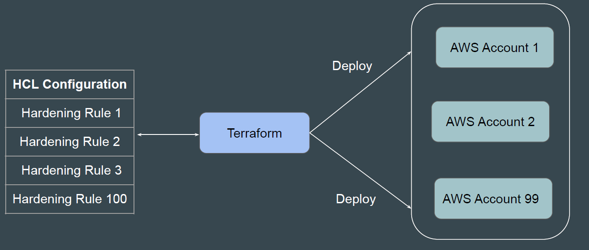
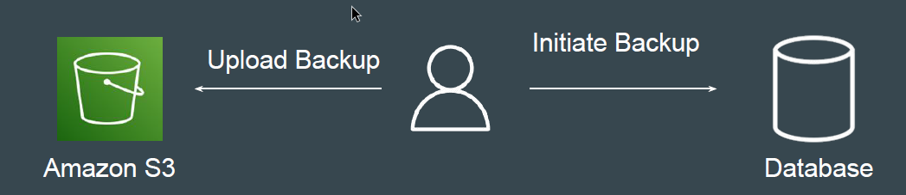
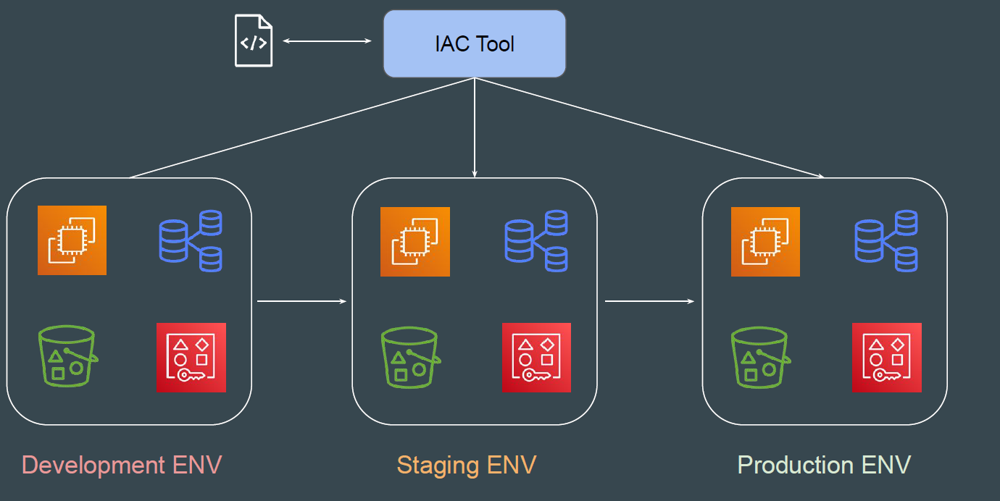
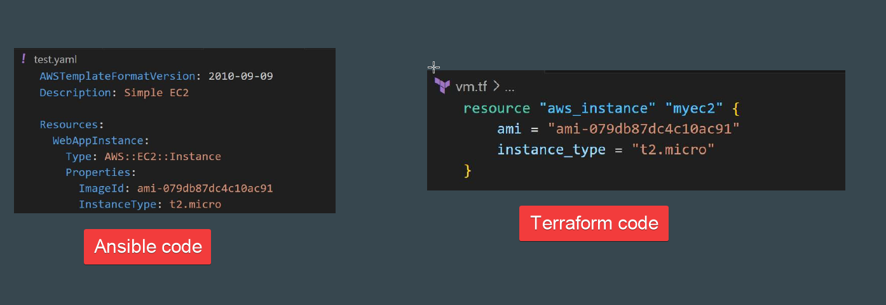

# Understanding the Basics

There are two ways in which you can create and manage your infrastructure:

1- Manually approach

2- Through Automation

## Challenge that Terraform Solves

Terraform allows us to create reusable code that can deploy an identical set of
infrastructure resources in a repeatable fashion.

## example 1 - Database Backup

I was assigned a task to take database backup every day at 10 PM and the
backup had to be stored in Amazon S3 Storage with appropriate timestamp.

- db-backup-01-01-2024.sql
- db-backup-02-01-2024.sql

Initially due to lack of time, I used to manually take DB backup at 10 PM and
upload it to S3.

If a particular task has to be done in an repeatable manner, it MUST be
automated.

- Depending on the type of task, the tools for automation will change.
- There are wide variety of Tools & Technologies used for Automation like Ansible, CloudFormation, Terraform, Python etc.

## example 2 - Create Single service in diffrent enviroment

If we want to create set of resources (Virtual Machine, Database, S3, AWS Users)
with exact similar configuration in Dev, Stage and Production environment.

Infrastructure as Code (IaC) is the managing and provisioning of infrastructure
through code instead of through manual processes.

## Benefits of Infrastructure As Code

There are several benefits of designing your infrastructure as code:

- Speed of Infrastructure Management.
- Low Risk of Human Errors.
- Version Control.
- Easy collaboration between Teams.
