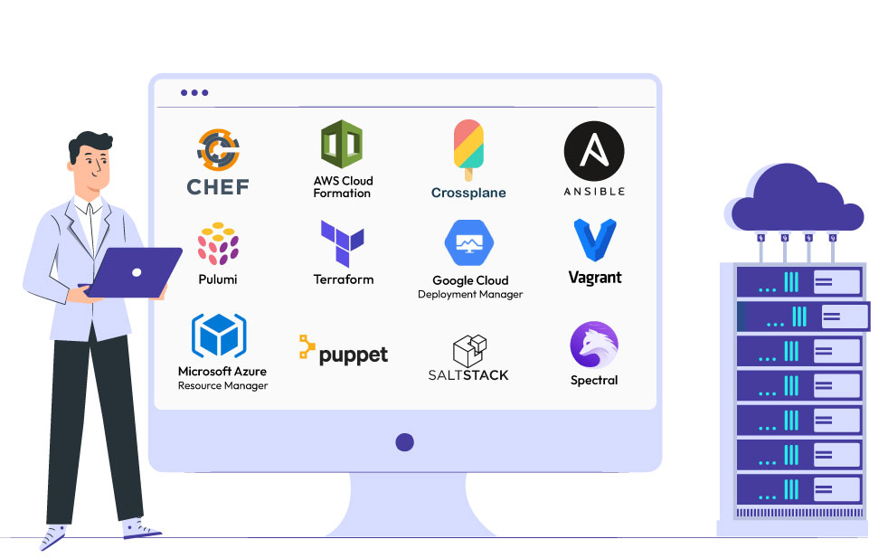
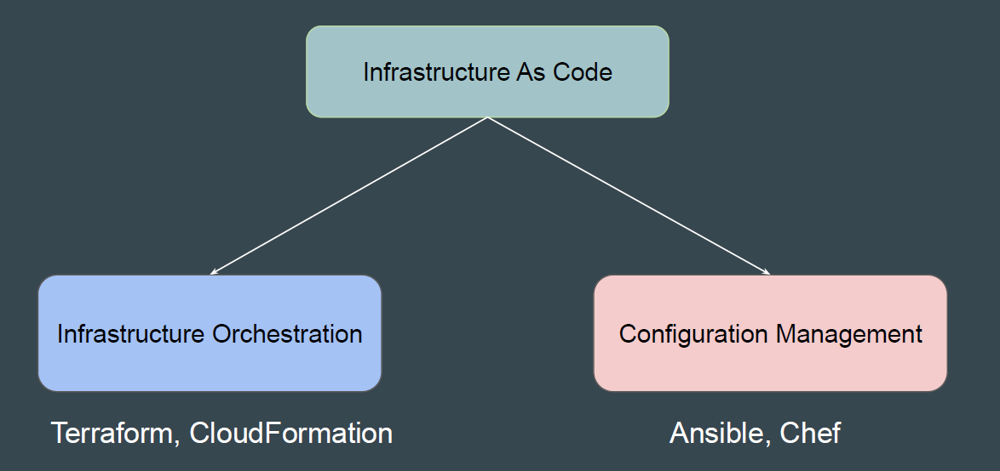
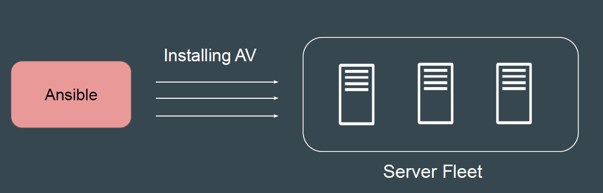
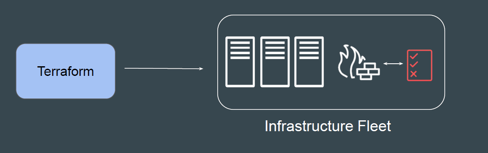
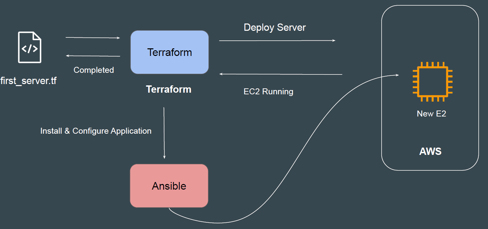

# Choosing Right IAC Tool

There are various types of tools that can allow you to deploy infrastructure as
code :

- Terraform
- CloudFormation (AWS)
- Heat (OpenStack)
- Ansible
- ARM (Azure)
- Bicep (Azure)
- Chef, Puppet

## Categories of Tools

The tools are widely divided into two major categories

## Configuration Management

Configuration Management tools are primarily used to maintain desired
configuration of systems (inside servers)
Example: ALL servers should have Antivirus installed with version 10.0.2

## Infrastructure Orchestration

Infrastructure Orchestration is primarily used to create and manage
infrastructure environments.
Example: Create 3 Servers with 4 GB RAM, 2 vCPUs. Each server should have
firewall rule to allow SSH connection from Office IPs.

## IAC & Configuration Management = Friends

## How to choose IAC Tool?

- Is your infrastructure going to be vendor specific in longer term ? Example AWS.
- Are you planning to have multi-cloud / hybrid cloud based infrastructure ?
- How well does it integrate with configuration management tools ?
- Price and Support

## Use-Case 1 - Requirement of Organization 1

- Organization is going to be based on AWS for next 25 years.
- Official support is required in-case if team face any issue related to IAC tool or
  code itself.
- They want some kind of GUI interface that supports automatic code
  generation.

## Use-Case 2 - Requirement of Organization 2

- Organization is based on Hybrid Solution. They use VMware for on-premise
setup; AWS, Azure and GCP for Cloud.

- Official support is required in-case if IAC tool has any issues.
