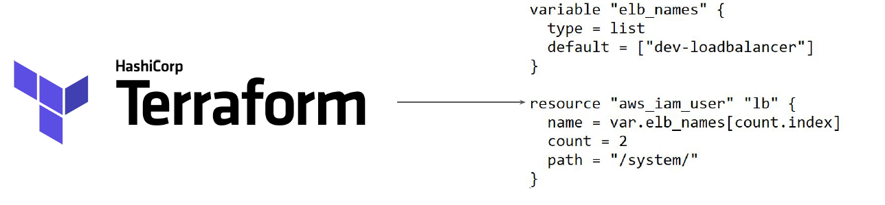
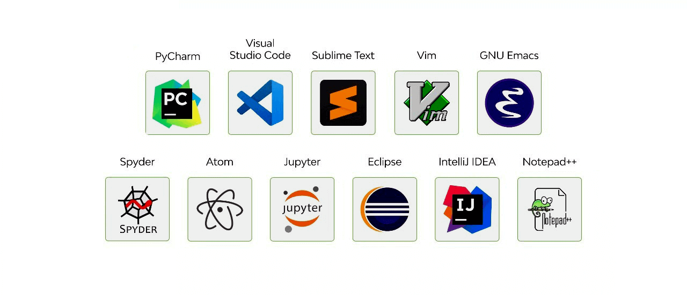
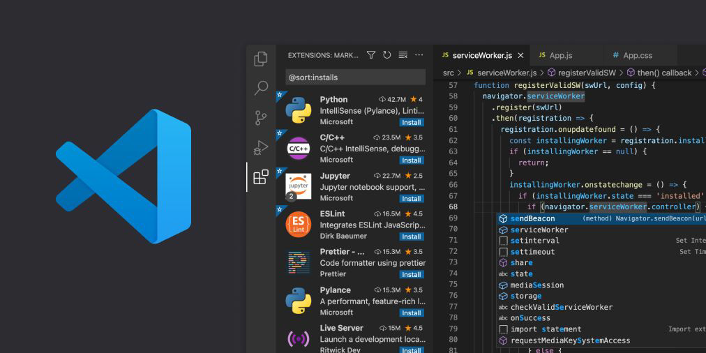
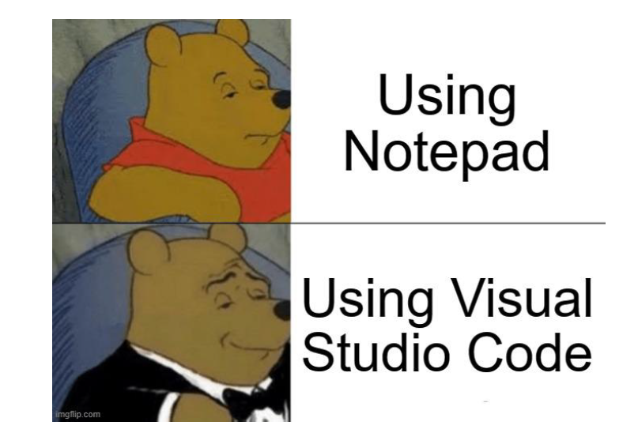

# Choosing IDE For Terraform

## Terraform Code in NotePad

knowledge portal
You can write Terraform code in Notepad and it will not have any impact.

Downsides:

- Slower Development
- Limited Features

## Need of a Better Software

knowledge portal
There is a need of a better application that allows us to develop code faster.

# Editor for This Course

knowledge portal
We are going to make use of Visual Studio Code as primary editor in this course.
Advantages:

1. Supports Windows, Mac, Linux
2. Supports Wide variety of programming languages.
3. Many Extensions.

