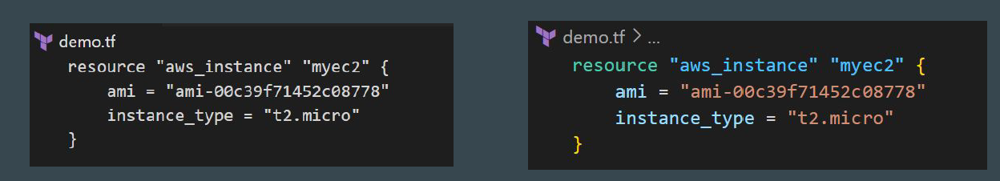

# Visual Studio Code Extensions

## Understanding the Basics

Extensions are add-ons that allow you to customize and enhance your
experience in Visual Studio by adding new features or integrating existing tools
They offer wide range of functionality related to colors, auto-complete, report
spelling errors etc.

## Terraform Extension

HashiCorp also provides extension for Terraform for Visual Studio Code.

