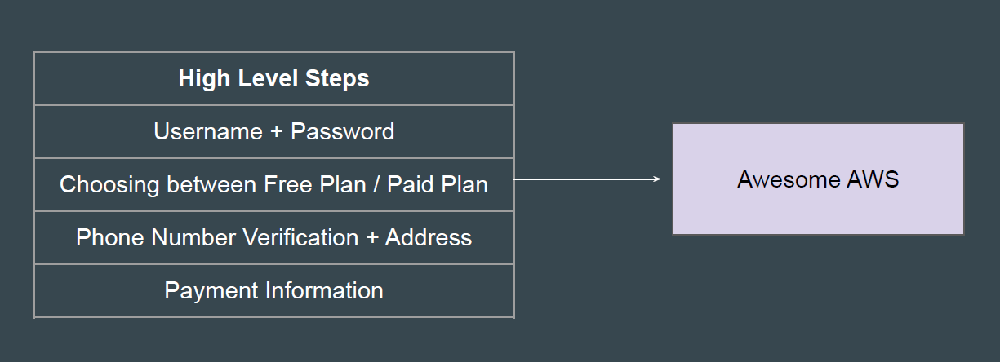
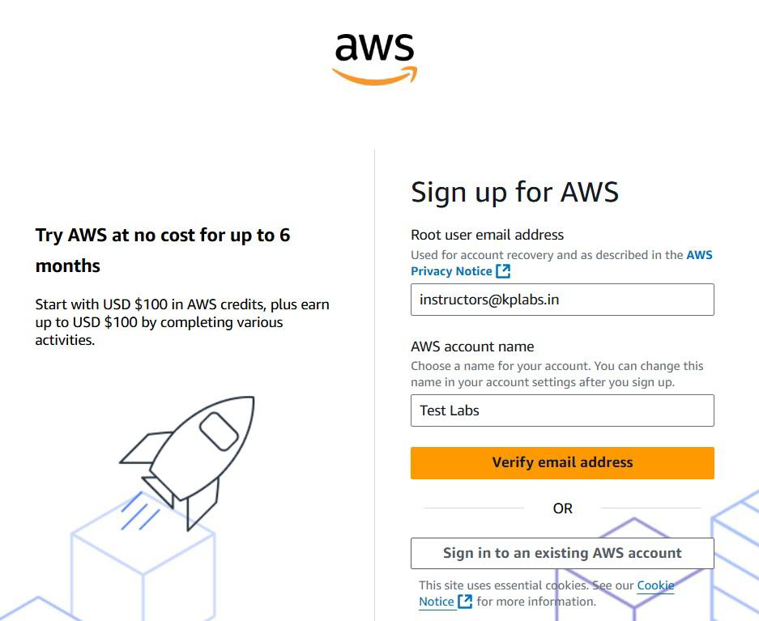
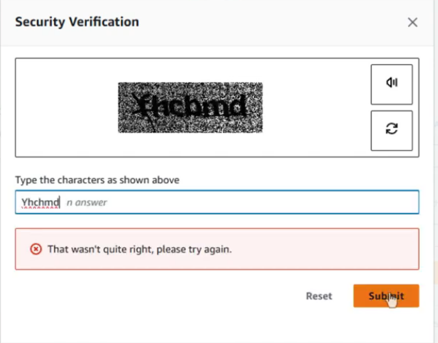
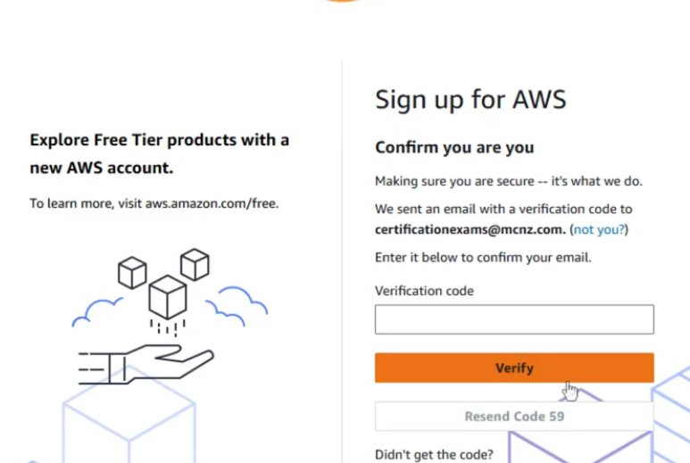
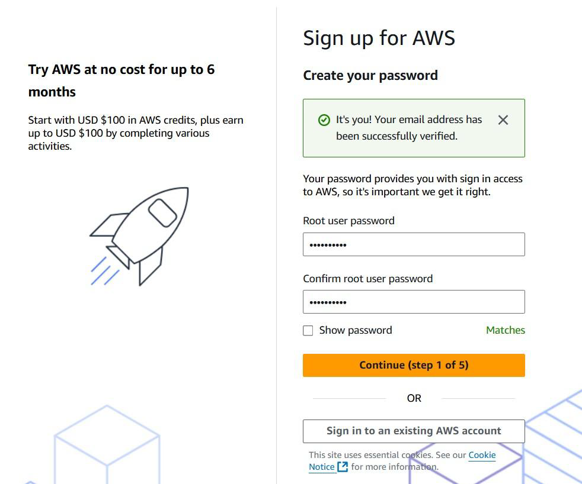
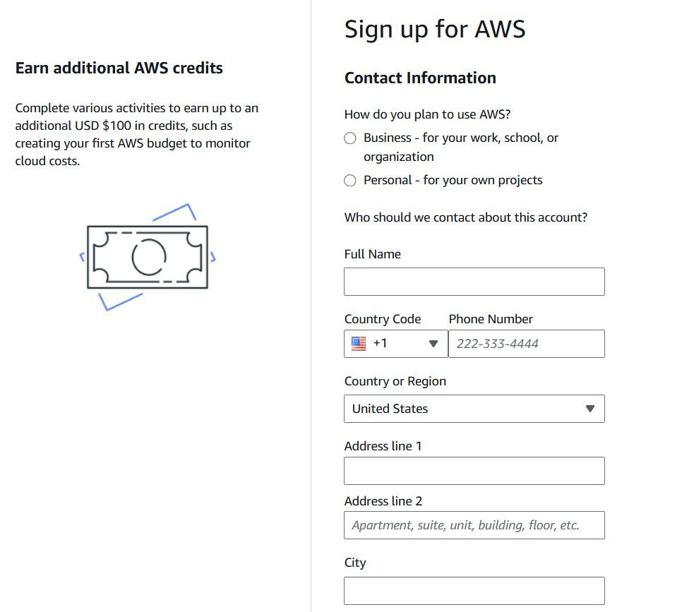
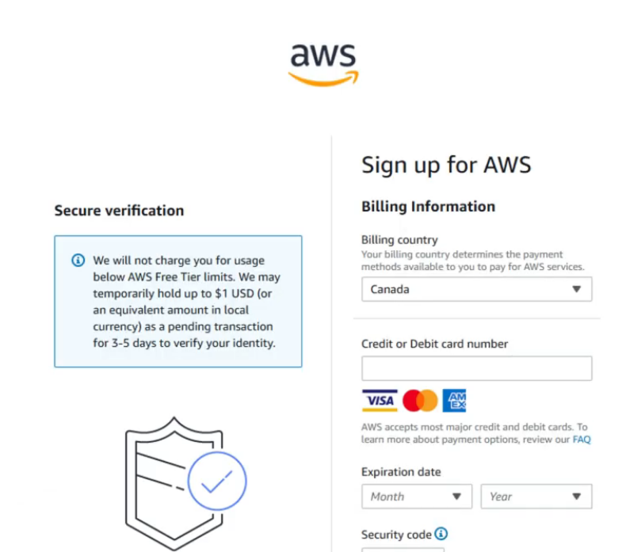
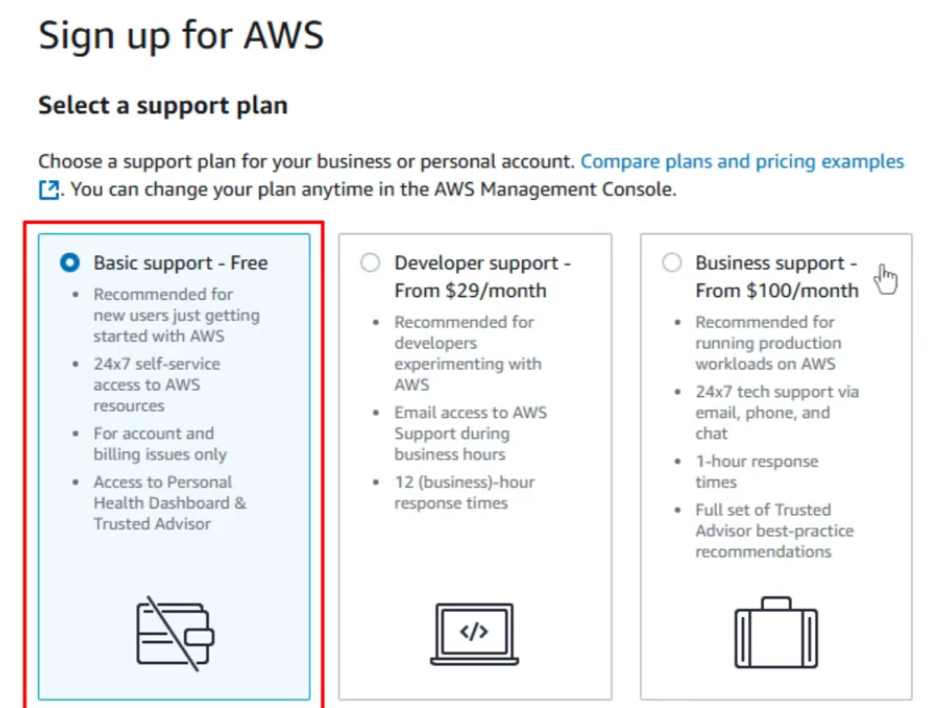

# AWS Account Sign-Up Process

## Signing Up for AWS Account

Creating a new AWS account is a simple and straightforward process.

### use below adderres to create account

<https://signin.aws.amazon.com/signup?request_type=register&refid=efa493d2-df04-4775-942a-b74f7eee1515>

### Reference Screenshot - Email Address

### Security Verification

### Confirm Verification Code

### confirm your password

### Reference Screenshot - Contact Information

### Billing inforamtion

### Select A support Plan

