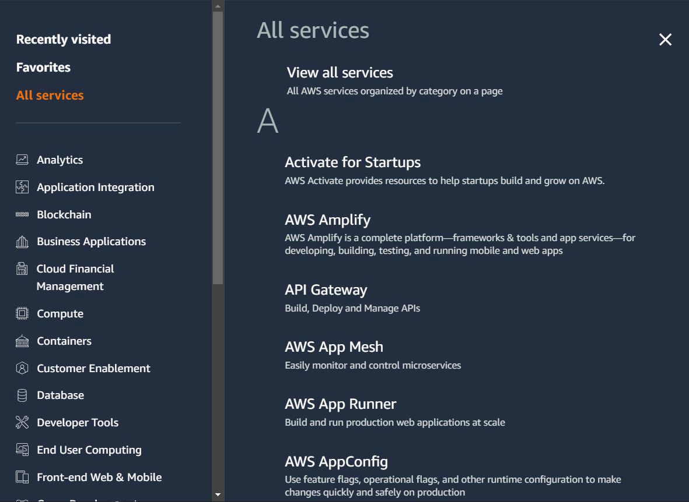

# Overview of the Format

We tend to use a different folder for each practical that we do in the course.
This allows us to be more systematic and allows easier revisit in-case required.

| Folder Name              | Contents |
|---------------------------|--------------|
| Create First EC2 Instance | How to create Ec2   |
| Tainting resource         | What is taninting    |
| Conditional Expression    | what is Conditional Expression |

## Destroy Resource After Practical

After you have completed your practical, make sure you destroy the resource before moving to
the next practical. we will talk about Terraform Destroy in this chapter3 on section 07.
This is easier if you are maintaining separate folder for each practical.

## Understanding the Basics

AWS has more than 200 services available.

## Aim of the Course

Primary aim of this course is to master the core concepts of Terraform.
Terraform = Infrastructure as Code Tool.
To learn Terraform, we need to create infrastructure somewhere.

## Services that we Choose

Throughout the course, we use very basic AWS services to demonstrate
Terraform concepts.

- Virtual Machine (EC2)
- Firewall (Security Groups)
- AWS Users (IAM Users)
- IP Address (Elastic IP)

## Basics of These Services are Covered

We have lots of students from different background who are learning
Terraform.
Some are AWS Pros, Some are from Azure/GCP, Some are students
To align everyone on same page, we also cover basics of the AWS service that
we use throughout the course.

## Example - Creating Firewall Through Terraform

1. Basics of Firewalls in AWS
2. Firewall Practical in AWS (GUI Console)
3. Creating Firewall Rules Through Terraform.
