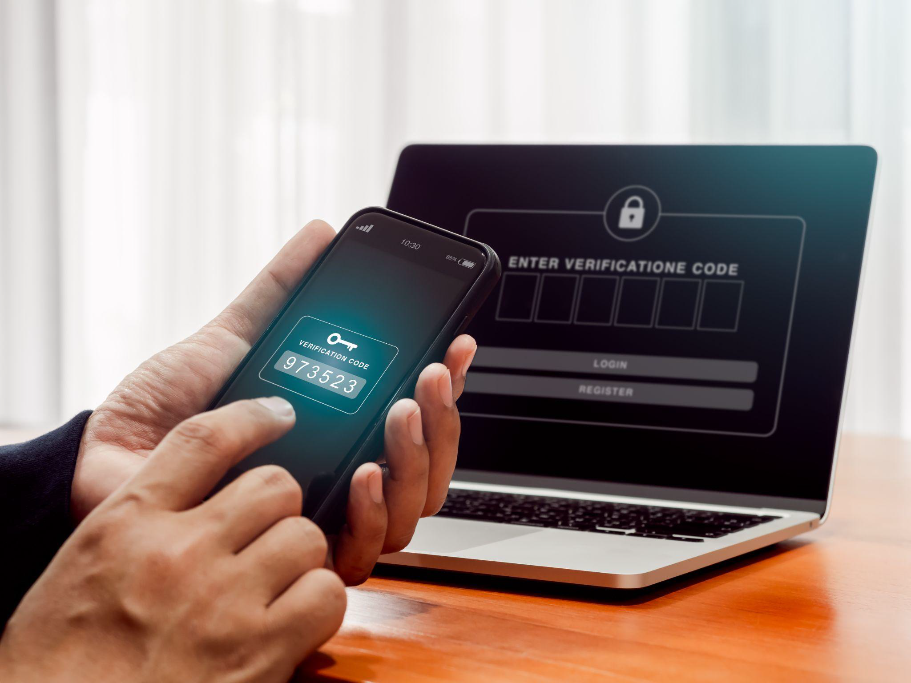
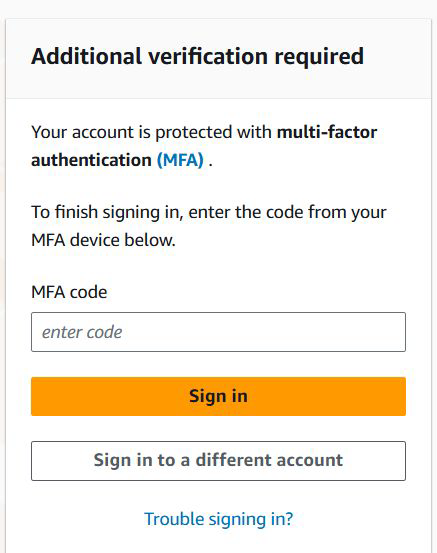
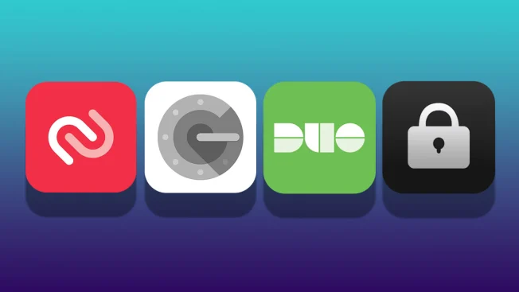
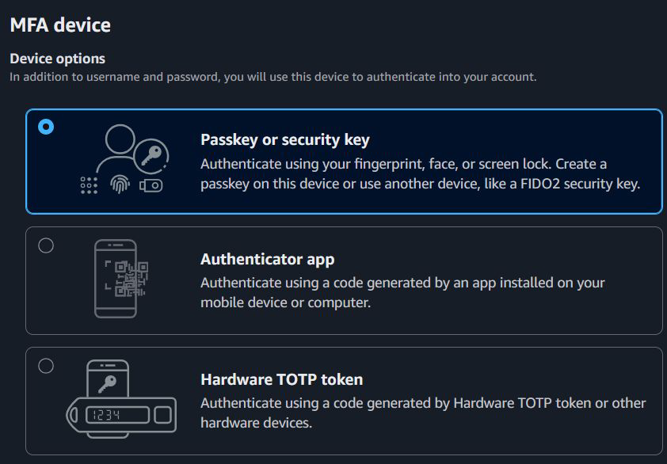

# MFA for AWS Account

## Multi-Factor Authentication is Important

Your AWS account is connected to your payment methods (such as debit or
credit cards).
If your login credentials are compromised, an attacker could deploy hundreds of
servers for activities like Bitcoin mining, resulting in significant charges to your
account.

## Setting the Base

With MFA enabled, when a user signs in to the AWS Management Console, they
are prompted for their username and password— something they know—and an
authentication code from their MFA device— something they have

## Multiple Ways to Set MFA - Authenticator Apps

There are several options available for setting up multi-factor authentication
(MFA), such as Google Authenticator and Authy.

### Device Options for MFA

You can use Passkey, Authenticator app, and Hardware TOTP token for setting
up MFA

