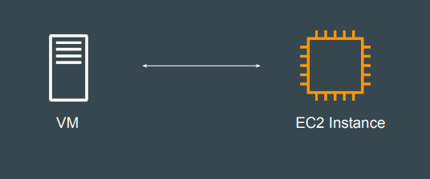

# First Virtual Machine Through Terraform

## Revising the Basics of EC2

EC2 stands for Elastic Compute Cloud.
In-short, it's a name for a virtual server that you launch in AWS.

## Available Regions

Cloud providers offers multiple regions in which we can create our resource.
You need to decide the region in which Terraform would create the resource.

<https://aws.amazon.com/about-aws/global-infrastructure/regions_az/>

## Virtual Machine Configuration

 A Virtual Machine would have it’s own set of configurations.

- CPU
- Memory
- Storage
- Operating System
While creating VM through Terraform, you will need to define these.
