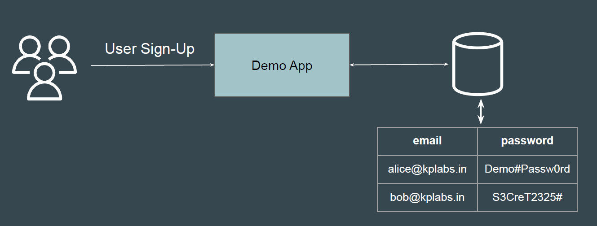
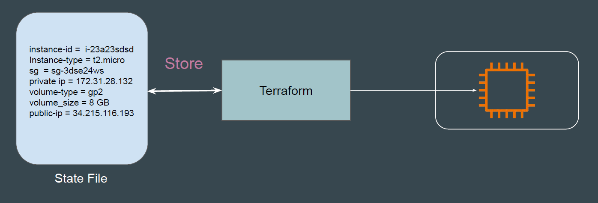

# Terraform State File

## Simple Analogy

The demo application provides a frontend interface for users and stores all the
data in a backend database.

## Terraform State File

Terraform stores information about managed infrastructure in a state file.
This state file keeps track of resources created by your configuration.

## Point to Note

1. By default, the state information is stored in file named terraform.tfstate
2. Format of state file is JSON
3. Never modify the Terraform State file manually. Any mistake can cause
corruption of state file.
