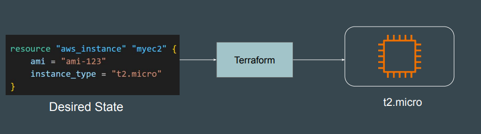
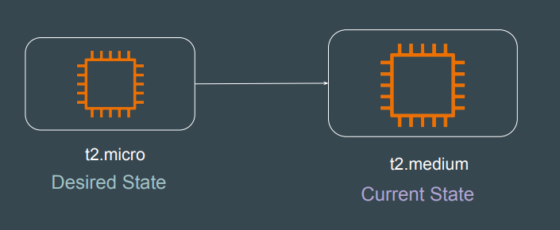
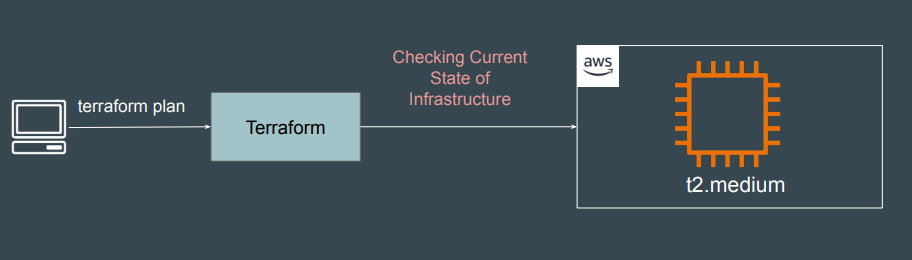
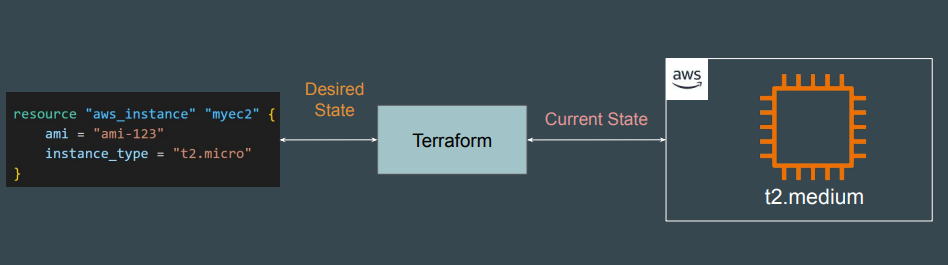
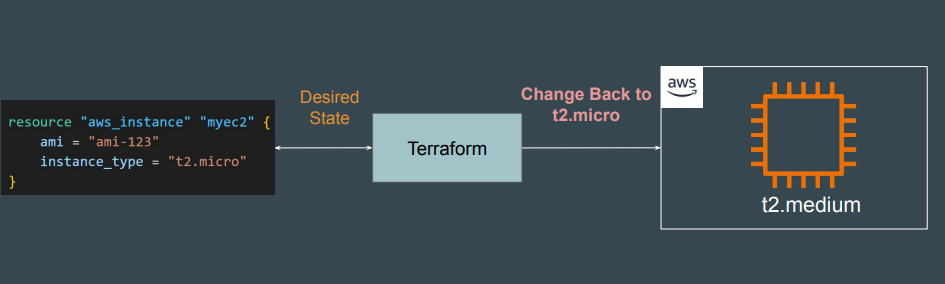
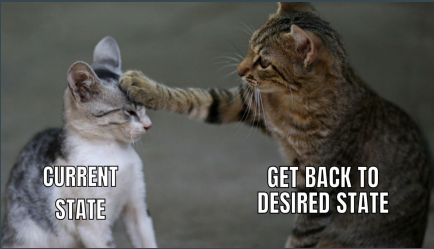

# Desired State and Current State

## Desired State (The "What You Want")

The Desired State is the configuration you write in your Terraform files (usually
ending in .tf).
Your desired state is EC2 instance of t2.micro and OS associated with “ami-123”

## Current State (The "What Actually Exists")

The Current State represents the actual reality of your infrastructure.
Example: Bob manually modified the instance size from t2.micro to t2.medium

## The Reconciliation Process (Part 1)

When you run terraform plan or terraform apply, Terraform first reaches out to
the Cloud Provider API to check the Current State of Infrastructure.

## The Reconciliation Process (Part 2)

Terraform compares the Current State (what it just found in the cloud) against
your Desired State (your .tf files).

## The Reconciliation Process (Part 3)

Based on the difference, Terraform determines what actions are necessary to
make the Current State match the Desired State.

## Generic Actions

Based on the difference, Terraform determines what actions are necessary to
make the Current State match the Desired State.

| Action  | Description |
|--------|-------------|
| Create | If Desired exists but Current does not. |
| Update | If both exist, but a property differs. |
| Delete | If Current exists (and is tracked in the state file) but Desired (the code) has been removed. |
| No-Operation  | If Current matches Desired exactly. |

