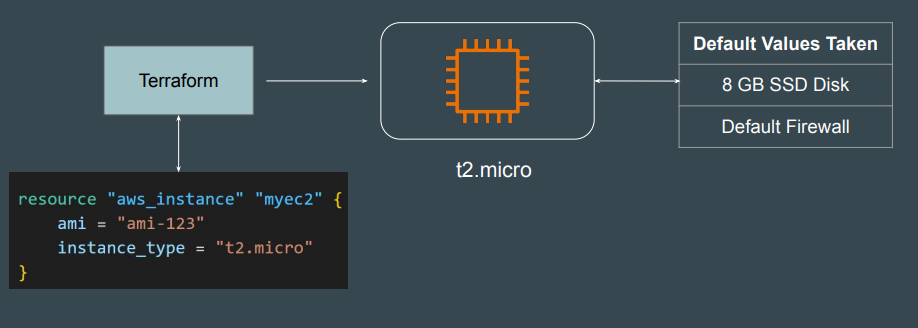
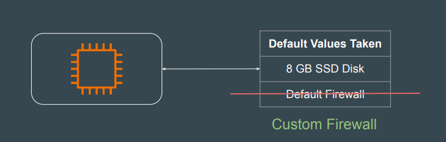

# More Clarity - Desired State and Current State

## Setting the Base

When you launch an EC2 instance without specifying certain configuration
parameters, AWS automatically assigns default values to those unspecified
settings.

## Point to Note

These default values are generally not considered to be your desired state.
If you manually change these default values, it will have no impact in next
terraform plan and apply stages.

### Best Practice

Explicitly Define All Desired Attributes in Your Configuration.
