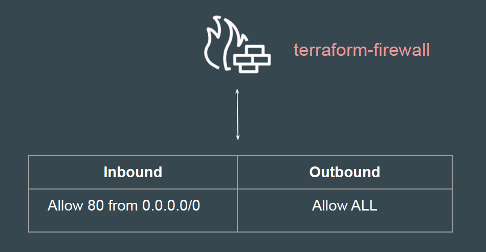
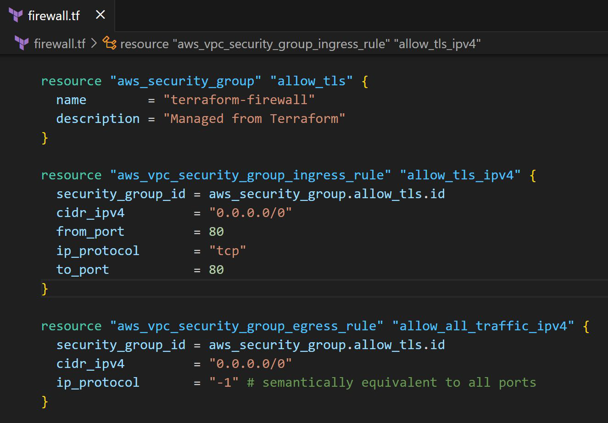

# Creating Firewall Rules with Terraform

## our architecture plan

We will create a Firewall (Security Group) in AWS with following configuration

## Reference - Final Code in Video

## Documentation Referred

<https://registry.terraform.io/providers/hashicorp/aws/latest/docs/resources/security_group>
