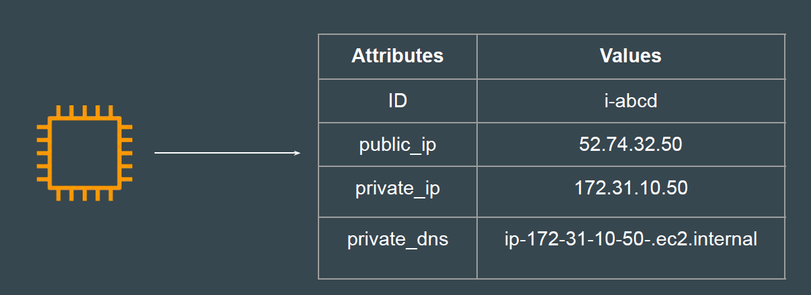
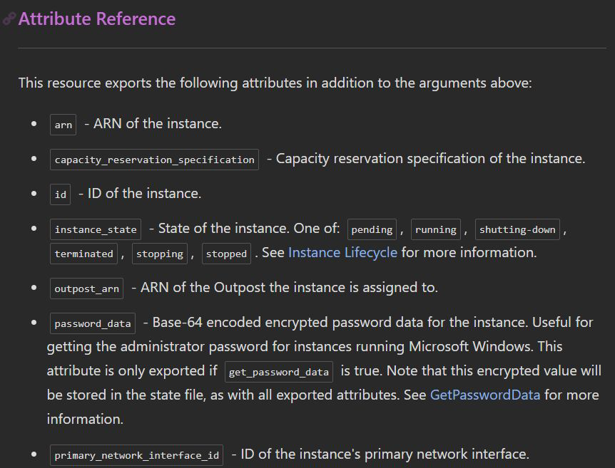

# Attributes

## Basics of Attributes

Each resource has its associated set of attributes.
Attributes are the fields in a resource that hold the values that end up in state file.

## Points to Note

Each resource type has a predefined set of attributes determined by the
provider.

## Documentation Referred

<https://registry.terraform.io/providers/hashicorp/aws/latest/docs/resources/eip>

<https://registry.terraform.io/providers/hashicorp/aws/latest/docs/resources/instance>
