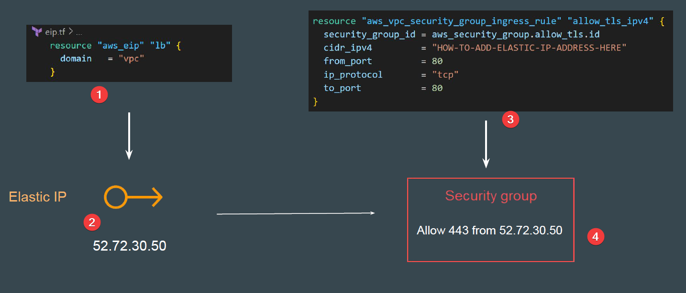
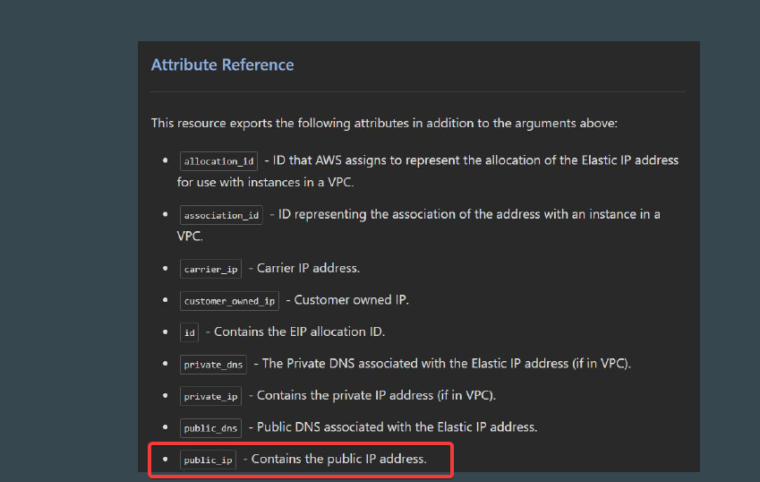
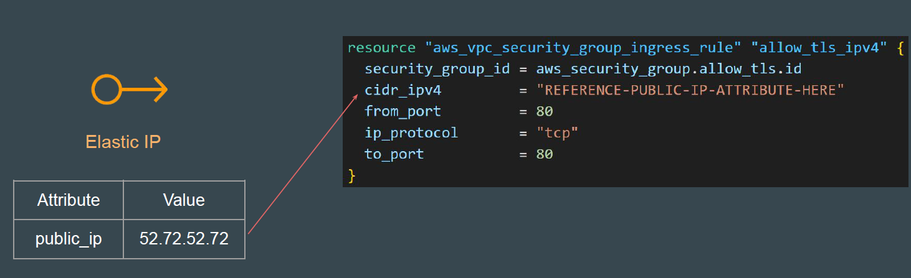
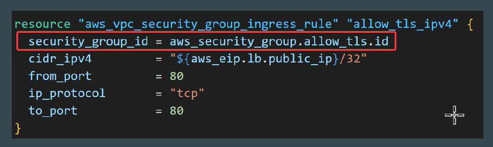
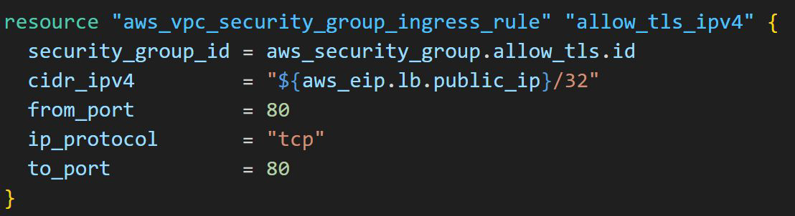

# Cross-Resource Attribute References

## Typical Challenge

It can happen that in a single terraform file, you are defining two different
resources.
However Resource 2 might be dependent on some value of Resource 1.

## Understanding The Workflow

## Analyzing the Attributes of EIP

We have to find which attribute stores the Public IP associated with EIP
Resource.

## Referencing Attribute in Other Resource

We have to find a way in which attribute value of “public_ip” is referenced to the
cidr_ipv4 block of security group rule resource.

## Cross Referencing Resource Attribute

Terraform allows us to reference the attribute of one resource to be used in a
different resource.
Overall syntax:

## Cross Referencing Resource Attribute

We can specify the resource address with attribute for cross-referencing.

For example :

### chalenge

lets practice attribute of this resource together !

## String Interpolation in Terraform

"${...}):" This syntax indicates that Terraform will replace the expression inside the
curly braces with its calculated value.

