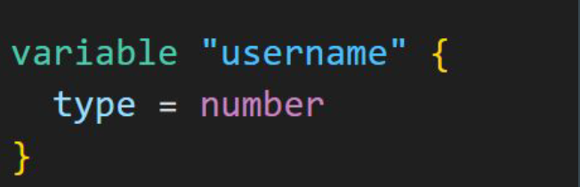

# Data Types

Data type refers to the type of value.
Depending on the requirement, you can use wide variety of values in Terraform
configuration.

| Example Data Type | Data Type |
|-------------------|-----------|
| "Hello World"     | String    |
| 7575              | Number    |

## Restricting Variable Value to Data Type

We can restrict the value of a variable to a data type.
Example:
Only numbers should be allowed in AWS Usernames.

## Data Types in Terraform

| Data Types | Description                                                                 |
|------------|------------------------------------------------------------------------------|
| string     | A sequence of Unicode characters representing some text, like `"hello"`.   |
| number     | A numeric value.                                                             |
| bool       | A boolean value, either `true` or `false`.                                   |
| list       | A sequence of values, like `["us-west-1a", "us-west-1c"]`.                   |
| set        | A collection of unique values that do not have any secondary identifiers or ordering. |
| map        | A group of values identified by named labels, like `{ name = "Mabel", age = 52 }`. |
| null       | A value that represents absence or omission.                                 |
