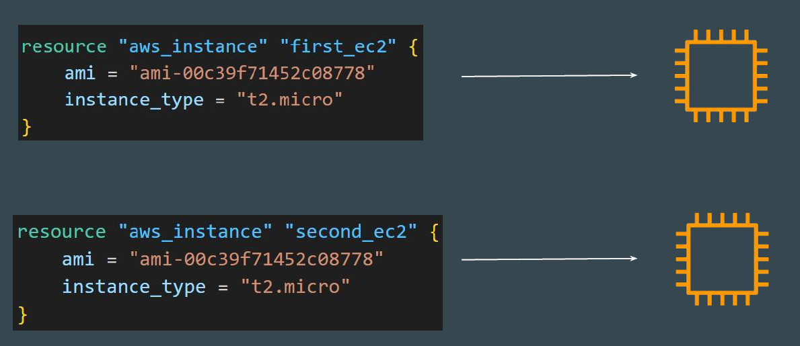
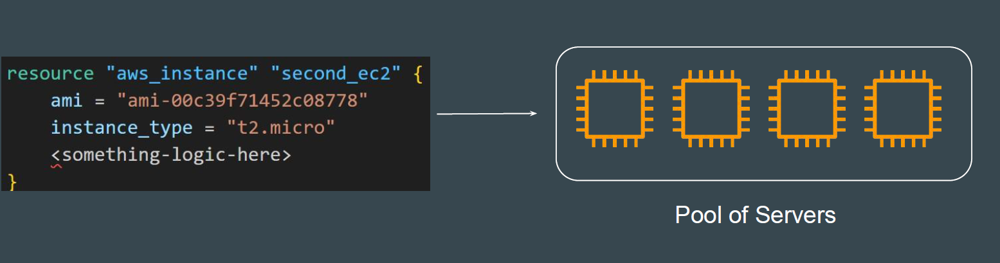
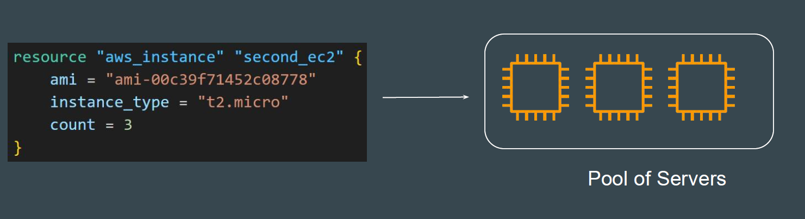
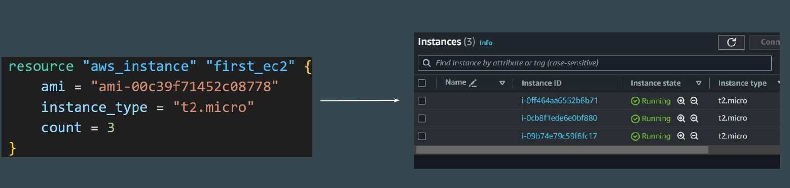
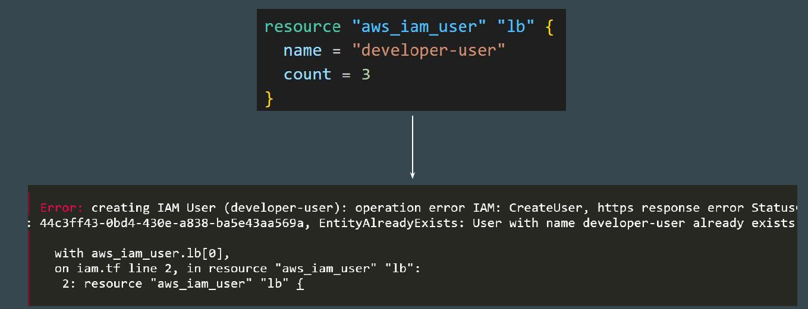

# The COUNT Meta-Argument

By default, a resource block configures one real infrastructure object.

# Understanding the Use-case scenario

sometimes you want to manage several similar objects ( like a fixed pool of compute instances) without a separate block for each one.

## Introducing Count Argument

The count argument accepts a whole number, and creates that many instance of the resource.
[The count Meta-Argument](https://developer.hashicorp.com/terraform/language/meta-arguments/count)

## Useful Document

<https://developer.hashicorp.com/terraform/language/meta-arguments/count>

## Challenges with count

The instances created through count and identical copies, but you might want to customize certain properties for each one.

## Example - IAM User

For many resources, exact identical copies are not required and will not work.

**Example** : You can not have multiple AWS USers with exact same name.

