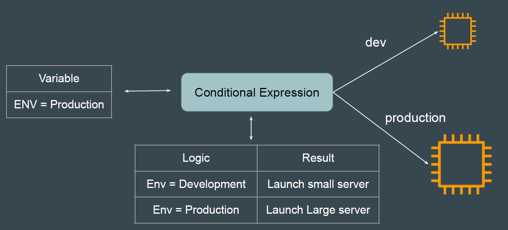
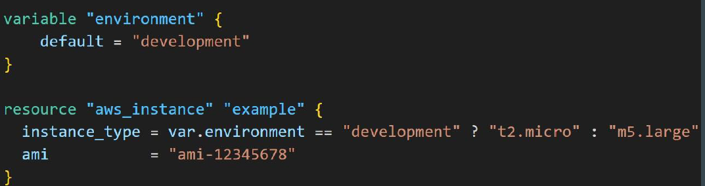
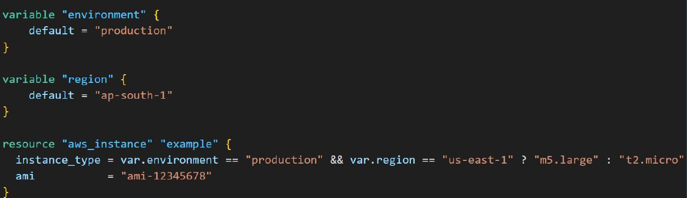

# Conditional Expression

Conditional expressions in Terraform allow you to choose between two values based on a condition.

## Syntax of Conditional Expression

the syntax of a conditional expression is as follows:

 

 if condition is true then the result is true_val. if condition is false then the result is false_val

## Conditional Expression Based on Use-Case

 If environment is Development "t2.micro" instance type should be used.

 If environment is not development, "m5.large" instance type should be use.

 

## Conditional Expression with Multiple Variables

 in the following example, only if env= production and region = us-east-1, the larger instance type of m5.large cab be used.

