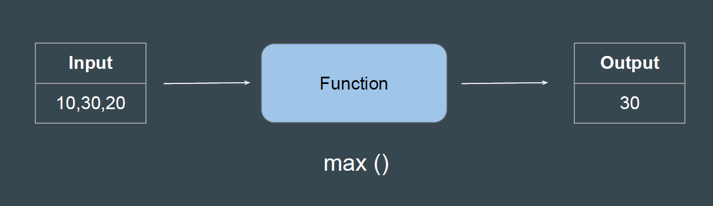
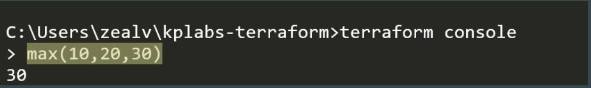
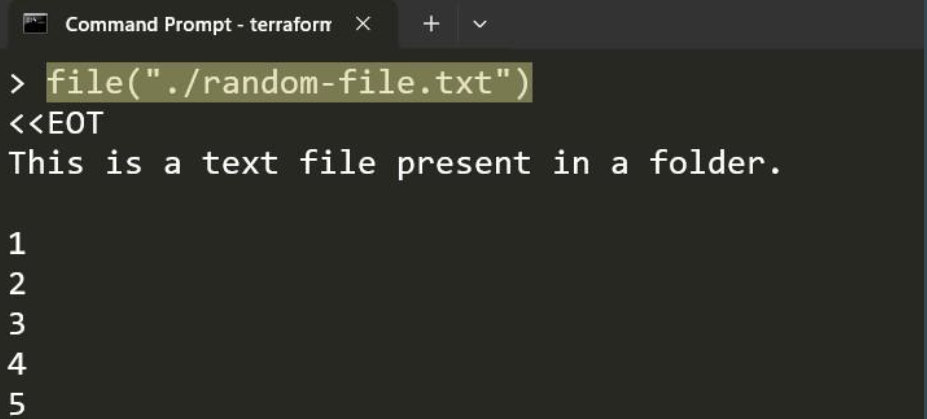
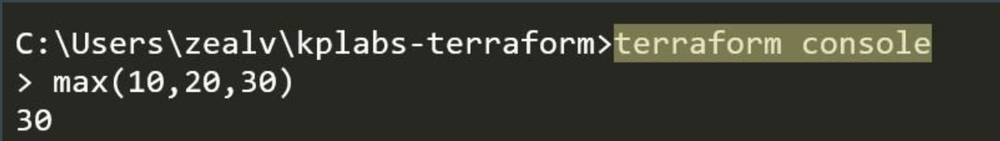
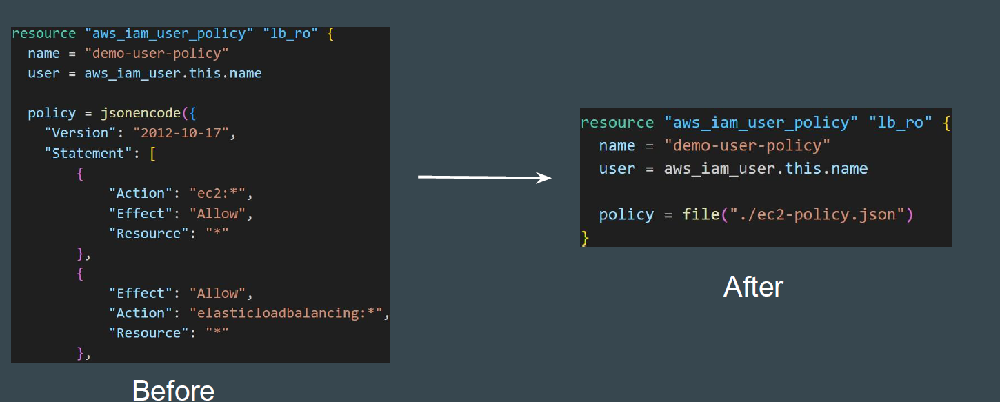

# Basic of Function

A function is a block of code that performs a specific task.

## Function 1 - MAX

max() take one or more numbers and return the greatest number.

## Function 2 - FILE

file () reads the contents of a file at the given path and return them as a string.

## Introducing Terraform Console

Terraform Console provides an interactive environment specifically designed to test functions and experiment with expressions before integrating them into your main code.

## Importance of File Function

File functions can reduce the overall Terraform code size by loading contents from external sources during terraform operations.

Terraform has wide variety of functions available to achieve different set od use-cases.
Functions are grouped into categories. Some of these include;

| Function Categories| Function Available                        |
|--------------------|-------------------------------------------|
| Numeric Functions  |abs, ceil, floor, max, min                 |
| String Functions   |  concat, replace, split, tolower, toupper |
|Collection Functions| element,keys,length, merge, sort          |
|FileSystem Functions| file, filebase64, dirname                 |

## Important Point of Note

The terraform language **does not support user-defined functions**, and so only the functions built in to the language are available for use.

[Terraform Function documents](https://developer.hashicorp.com/terraform/language/functions)
