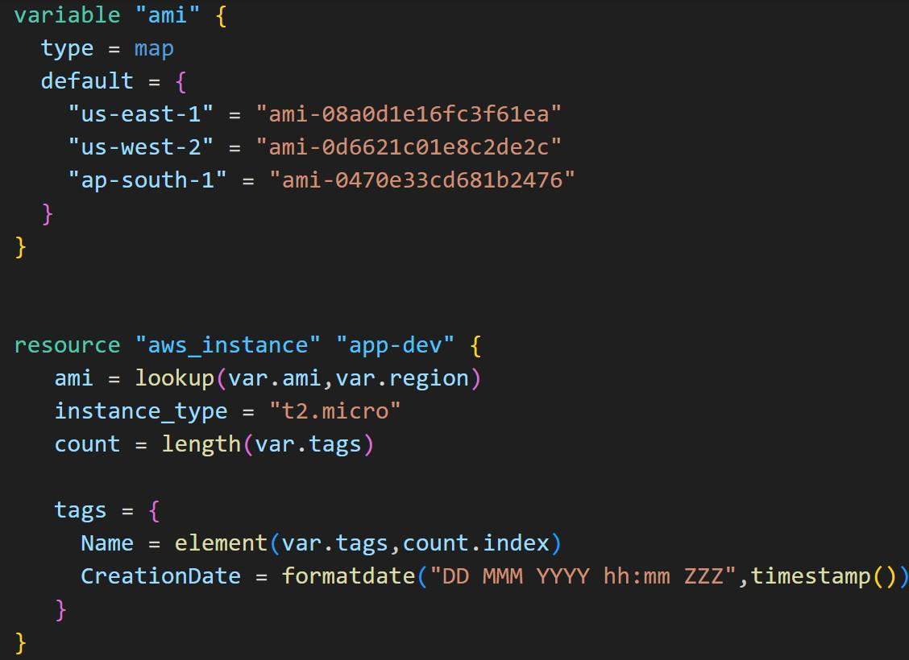

# Challenge - Analyzing Code Containing Functions

As part of this challenge, you will be given a code that contains multiple sets of
Terraform Functions.

## Setting the Base

You have to analyze what this code does without running the “apply” operation.

## Overall Workflow

- Analyze what exactly the given code in GitHub will do without running the
  “apply operation”.
- Analyze the outcome by applying function using Terraform Console and
  reading the documentation.
- Make a note of it.
- Run the “terraform apply” operation to verify if it matches your findings.
