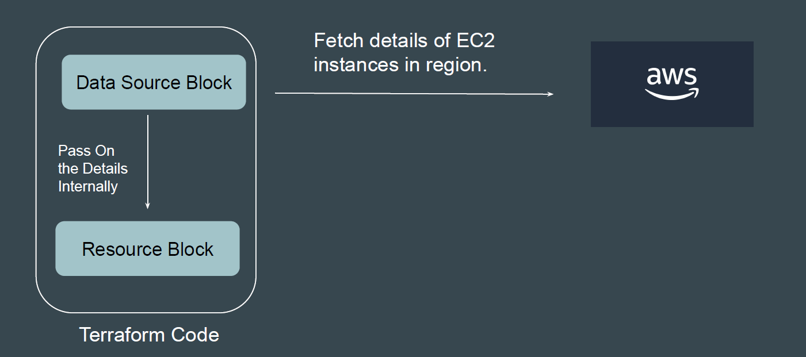
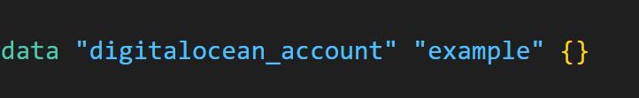
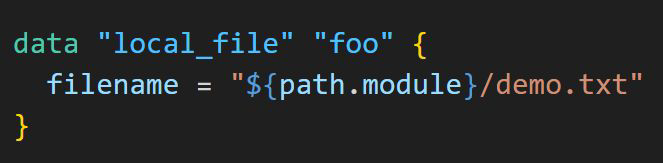
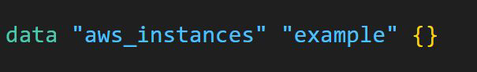

# Introducing Data Sources

Data sources allow Terraform to use /fetch information defined outside of Terraform.

## Example 1- Reading Info of Digital Ocean account

Following data source code is used to get information on your Digital Ocean account.

## Example 2- Reading file

Following data source allow you to read content of a file in your local filesystem.

"${PATH.module}" returns the current file system path where your code is located.

## Example 3- Fetch the Ec2 instance details

Following data source code is used to fetch detail about EC2 instance in your AWS region.

