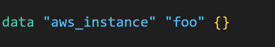
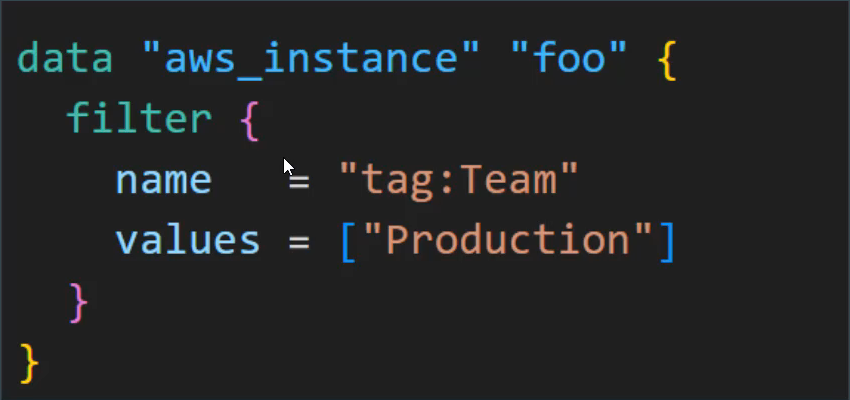

# Data Sources Format

## Understanding the Basic Structure

A data source is accessed via a special kind of resource known as a data
resource, declared using a data block:

Following data block requests that Terraform read from a given data source
("aws_instance") and export the result under the given local name ("foo").

## Filter Structure

Within the block body (between { and }) are query constraints defined by the
data source.

