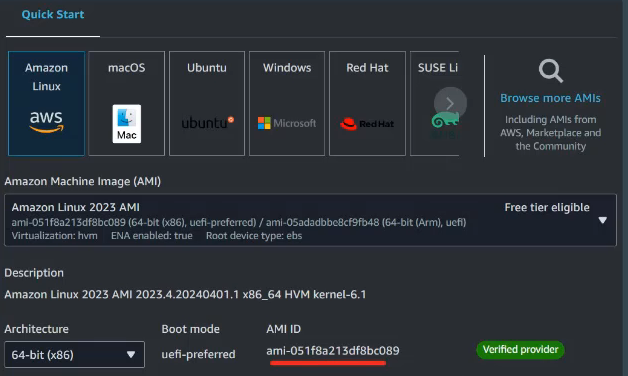
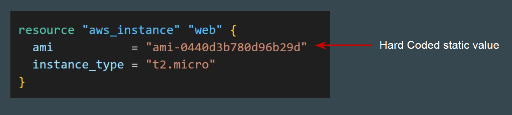
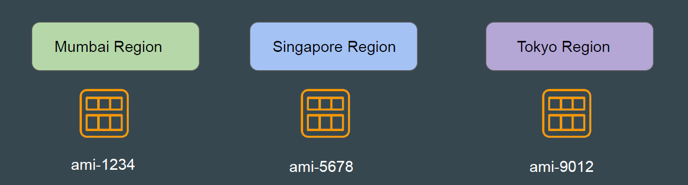
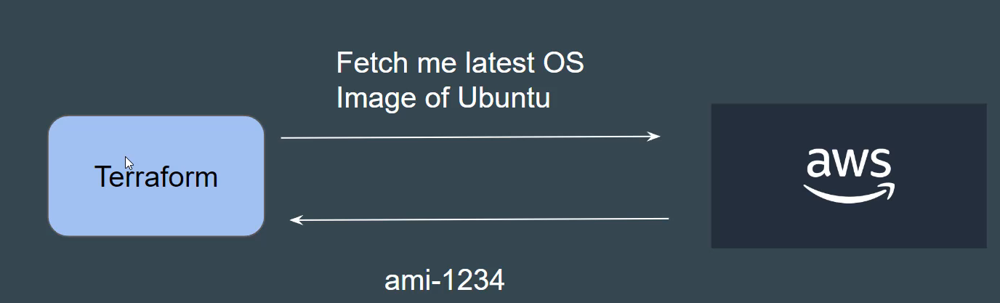
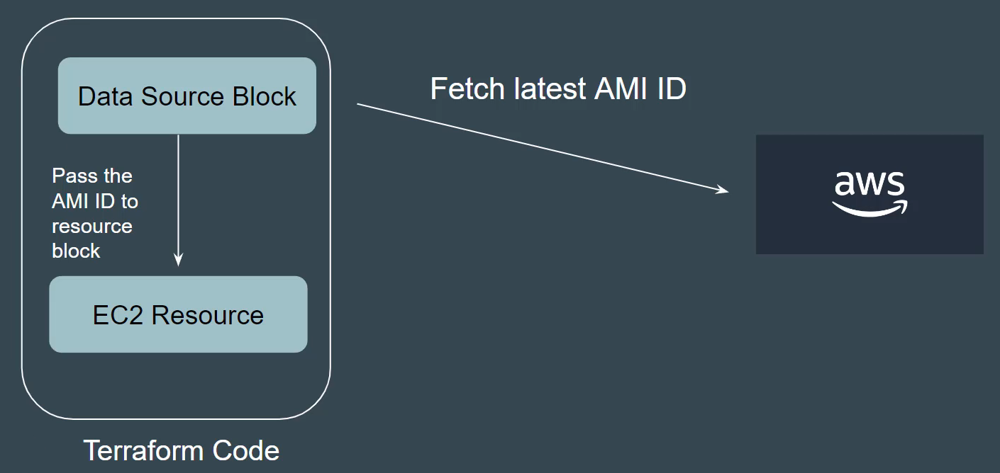

# Fetching Latest OS Image Using Data Sources

## Understanding the Requirement

You have been given a requirement to write a Terraform code that creates EC2
instance using latest OS Image of Amazon Linux.

## Approach that New User will Take

We want to use the latest OS image for creating server in AWS.
Steps that we typically follow:

1. Go to EC2 Console.

2. Fetch the latest AMI ID

3. Add that AMI ID in Terraform code.

## Sample Reference Code

## Static Information is Boring

Hardcoding static details in your Terraform code will lead you to repeatedly
modify your code to meet changing requirements.

## Another Challenge with Static Values

In many of the cases, the static value changes depending on the region.

Example: AMI IDs are specific to region.

Hardcoded AMI in code will only work for single region.

## Time to be Pros - Dynamic Configuration

We want Terraform to automatically query the latest OS image in AWS or any
other provide and use that for creating server.

We need code which works for all region without modification.

## Introducing Data Sources

Data sources allow Terraform to use information defined outside of Terraform
and we can use that information to provision resources.

