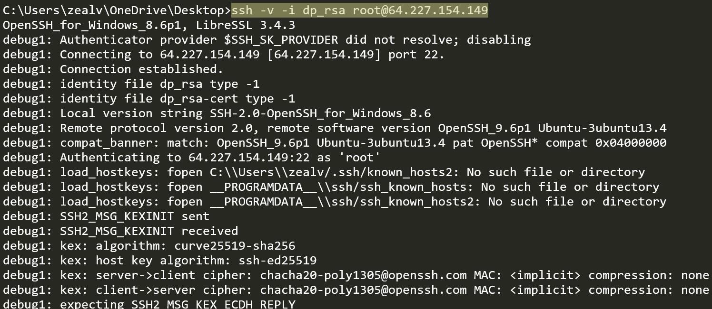
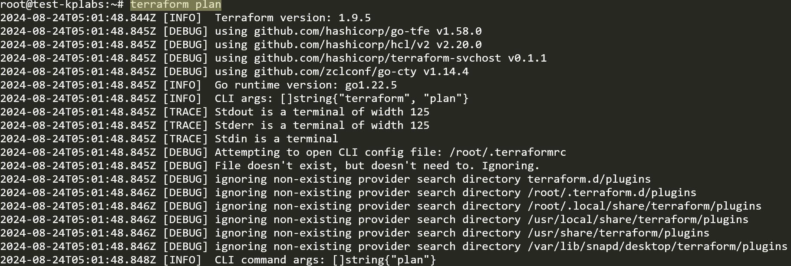

# Debugging Terraform

## Basics of Debugging

Debugging is the process of finding the root cause of a specific issue.

30-40% of the time of a System Administrator goes into Debugging.

## Example - SSH Verbosity

One of the important requirement in Debugging is getting detailed Log
Depending on the application, the approach to get detailed logs will differ.

## Debugging in Terraform

Similar to SSH Verbosity, even Terraform allows us to set wide variety of log
levels for getting detailed logs for debugging purpose.

## Debugging Terraform

Similar to SSH VErbosity, even Terraform allows us to set wide variety of log levels for getting detailed logs for debugging purpose.
Terraform has detailed logs that you can enable by setting by the **TF_LOG** environment variable to any value.

You can set TF_LOG to one of the log levels (in order of decreasing verbosity).

|log level|
|---------|
| TRACE   |
| DEBUG   |
| INFO    |
| WARN    |
| ERROR   |

## Storing the Logs to File

To persist logged output you can set TF_LOG_PATH in order to force the log to
always be appended to a specific file when logging is enabled

