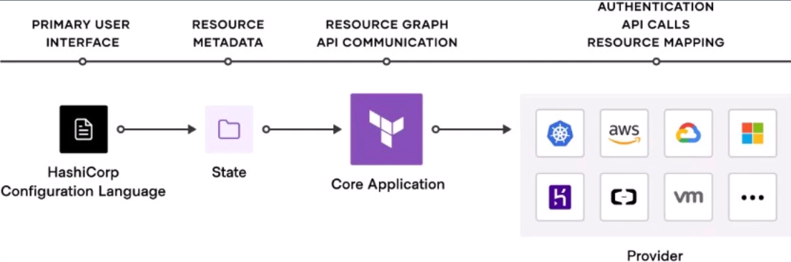
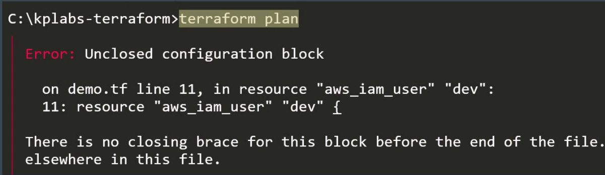
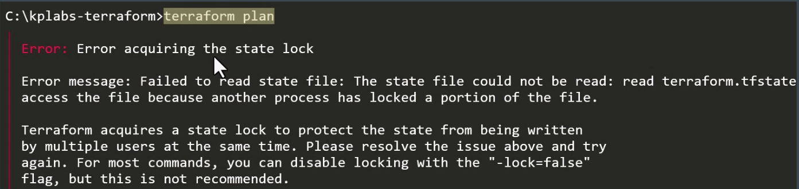
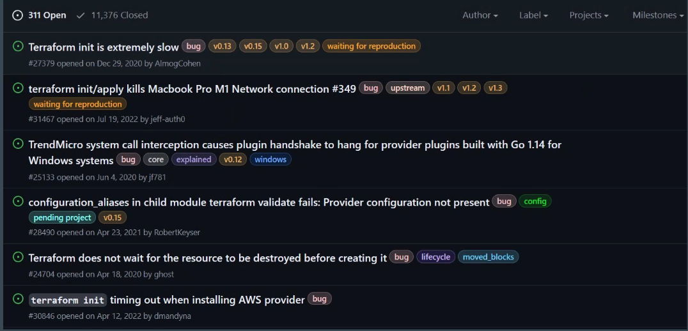
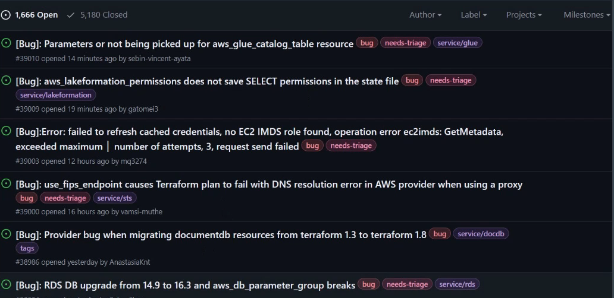

# Terraform Troubleshooting Model

There are four potential types of issues that you could experience with Terraform.

+ Language
+ State
+ Core
+ Provider Errors

## Language Errors

In most of the cases, the errors that you will face be related to this.
when Terraform encounters a syntax error in your configuration, it prints out the line numbers and an explanation of the error.

## State Errors

In state out of sync, Terraform may destroy or change your existing resources.
if state locked, you will also be blocked from running write operations.

## Core errors

These errors are directly related to the main Terraform application.
Errors produced at this level may be bug.

## Provider errors

These set of errors are primarily related to the provider plugins.
Use the Provider GitHub page for reporting and identifying the issue.

## Review Reporting Bugs

You can report bugs in the terraform Core GitHub page or appropriate provider page.
First, navigate to the Terraform GitHub repository and choose "Issues" from the top tabs.

Choose "New Issue".

Click "Get Started"

Fill Core Terraform Template

