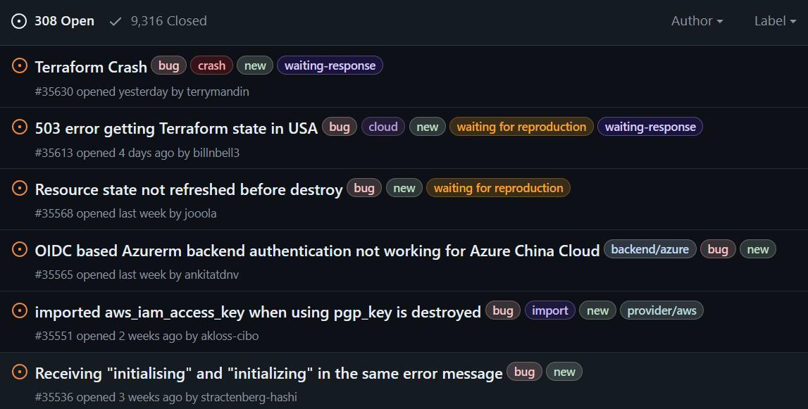
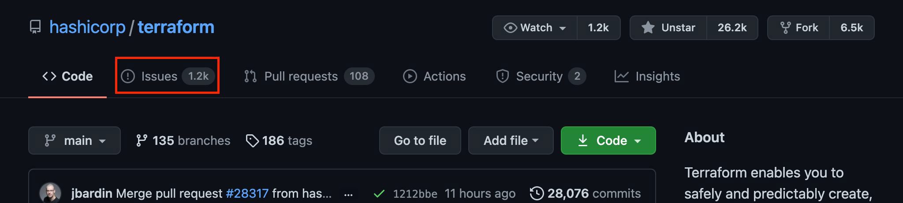
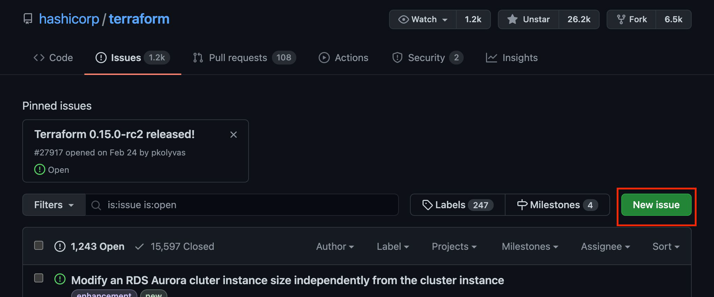
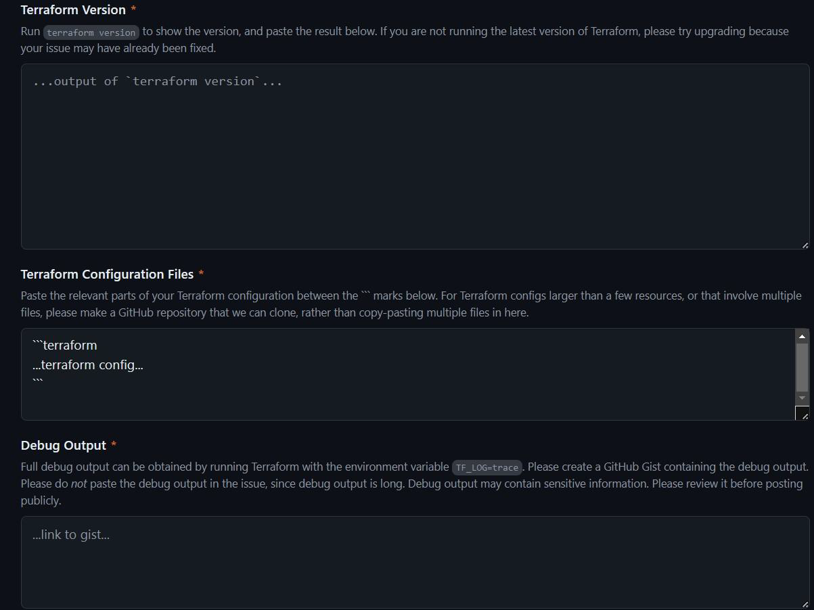

# Reporting Terraform Bugs

## Reporting Bugs

You can report bugs in the Terraform Core GitHub page or appropriate provider
page.

### 1 - Navigate to Issues

First, navigate to the Terraform GitHub repository and choose "Issues" from the
top tabs.

### 2 - Choose "New Issue"

### 3 - Click “Get Started”

### 4 - Fill Core Terraform Template

