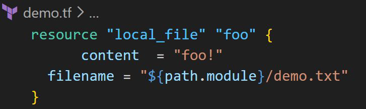
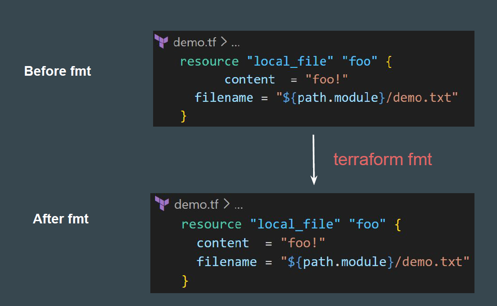
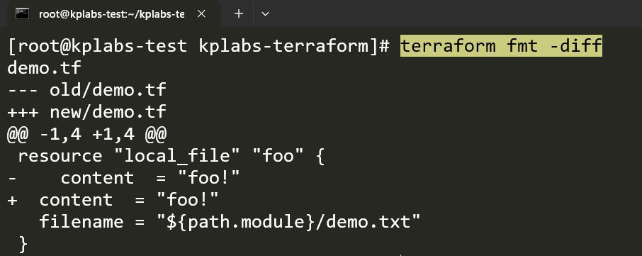
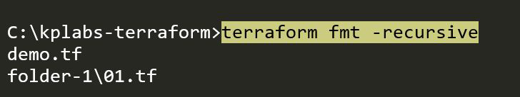
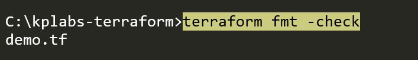

# terraform fmt

## Importance of Readability

When multiple engineers work on the same codebase, varying coding styles can
make code reviews painful and debugging difficult.

The terraform fmt command formats Terraform configuration file contents so that
it matches the canonical format and style

 

## Visualizing Changes

If you want to see exactly what terraform fmt is changing, use the -diff flag.

This is helpful for understanding the specific style adjustments being applied.

## Recursive Formatting

By default, terraform fmt only looks at the current directory.

If you have a complex project with subdirectories, use the -recursive flag.

## Check Mode (Dry Run)

In CI/CD pipelines, you often want to verify if the code is formatted correctly
without actually modifying it.

The -check flag returns 0 if all files are formatted correctly and 3 if any files
require formatting.

## Point to Note

terraform fmt does not change the behavior of your infrastructure; it only changes
how the code looks.
