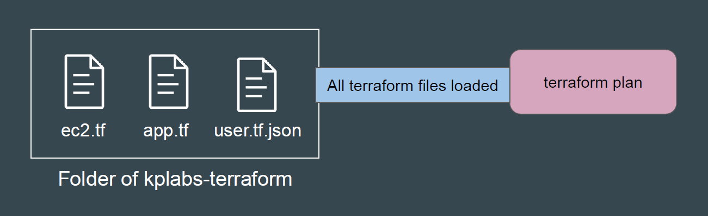
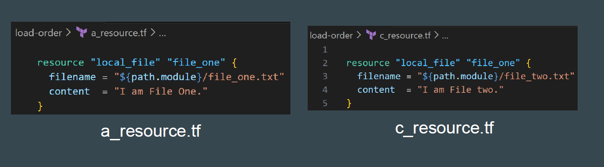

# Terraform - Load Order and Semantics

Terraform generally loads all the configuration files within the directory specified in
alphabetical order.

The file loaded must end in either .tf or .tf.json to specify the format that is in use.

## Point to Note

Since terraform loads all of the .tf and .tf.json files within a directory, it expects
each one to define a distinct set of configuration objects. If two files attempt to
define the same object, Terraform returns an error.

Example: The following two files are in same folder of “load-order”. It will result in
error when terraform plan/apply operations run.

## Point to Note

Terraform loads all configuration files within the directory specified in alphabetical
order.

Terraform does not automatically read sub-directories unless explicitly called.

Organizing code into networking.tf, compute.tf is for humans, not Terraform.
