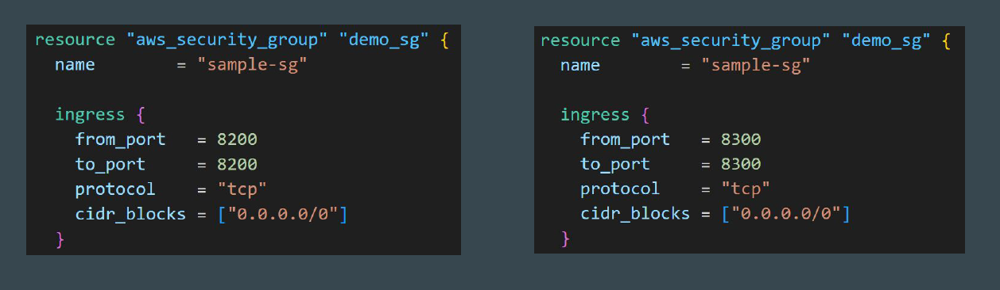
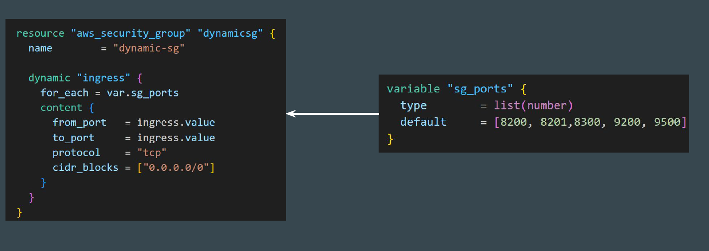

# Dynamic Blocks

# Understanding the Challenge

## Setting the Base

One of Terraform's powerful features for keeping your code DRY (Don't Repeat
Yourself) is the Dynamic Block.

If you have ever find yourself copy-pasting the same configuration block (like
ingress rules, etc) over and over again within a single resource, Dynamic Blocks
are the solution.

## Introducing Dynamic Blocks

A dynamic block allows you to generate these nested blocks programmatically
based on a variable (list or map), rather than writing them out manually.

