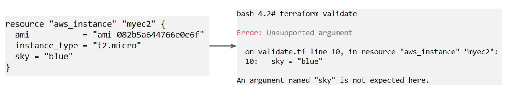

# Terraform Validate

"Terraform in detail"

## Overview of Terraform Validate

Terraform Validate primarily checks whether a configuration is syntactically valid.

It can check various aspects including unsupported arguments, undeclared variables and others.

