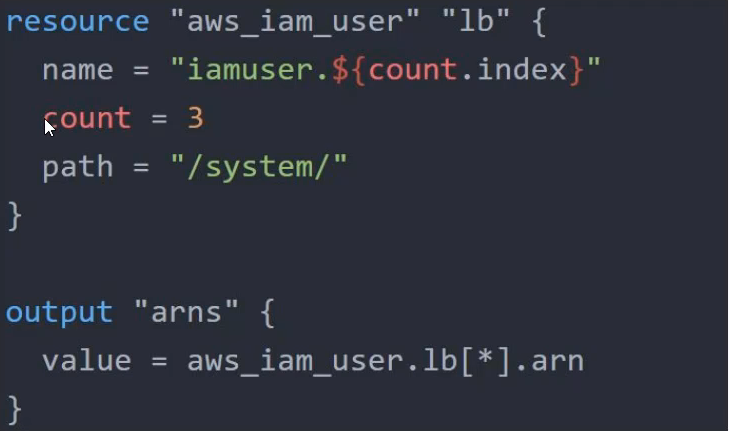

# Overview of Splat Expression

 Splat Expression allows us to get a list of all the attributes.

  <div align="center">
  
  </div>

### splat.tf sample file

```sh

provider "aws" {
  region     = "us-west-2"
  access_key = "YOUR-ACCESS-KEY"
  secret_key = "YOUR-SECRET-KEY"
}
resource "aws_iam_user" "lb" {
  name = "iamuser.${count.index}"
  count = 3
  path = "/system/"
}

output "arns" {
  value = aws_iam_user.lb[*].arn
}
```
