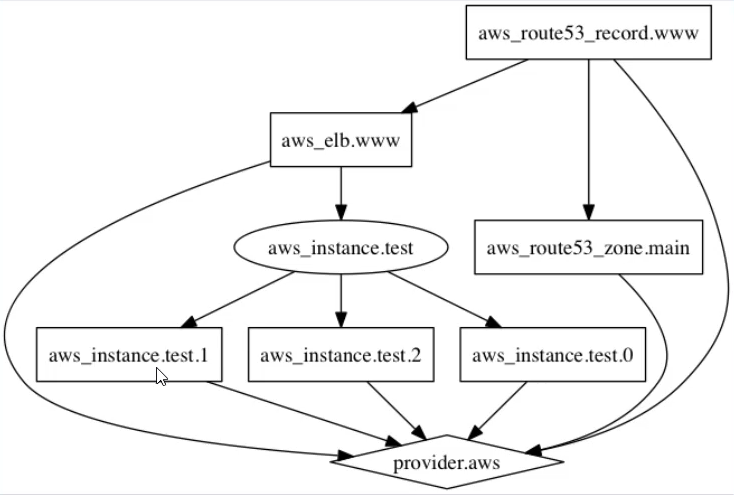

# Terraform Graph

Terraform Graph refers to a visual representation of the dependency relationships between resources defined in your Terraform configuration.

 <div align="center">
  
  </div>

## Generating Images

The graph output uses the [DOT language](https://en.wikipedia.org/wiki/DOT_(graph_description_language)), which is a machine-readable graph description language which originated in [Graphviz](https://graphviz.org/). You can use the Graphviz dot command to present the resulting graph description as an image. There are also various third-party online graph rendering services which accept this format.

If you have the Graphviz dot command already installed, you can render a PNG image by piping into that command:

```
terraform graph -type=plan | dot -Tpng >graph.png
```

if you are using server and have issue to show png file in cli enviroonment, you can use svg format instead of PNG.

```
terraform graph -type=plan | dot -Tsvg >graph.svg
```

## Summary and Conclusion

Terraform graph are a valuable tools for visualizing and understanding the relationships between resources in your infrastructure defined with Terraform.

It can improve your overall workflow by aiding in planning, debugging, and managing complex infrastructure configurations.

### Documentaion

[Terraform Geraph](https://developer.hashicorp.com/terraform/cli/commands/graph)

## terraform-graph.tf

```
resource "aws_eip" "lb" {
  domain   = "vpc"
}

resource "aws_security_group" "example" {
  name        = "attribute-sg"
}

resource "aws_vpc_security_group_ingress_rule" "example" {
  security_group_id = aws_security_group.example.id

  cidr_ipv4   = "${aws_eip.lb.public_ip}/32"
  from_port   = 443
  ip_protocol = "tcp"
  to_port     = 443
}

resource "aws_instance" "web" {
  ami           = "ami-0440d3b780d96b29d"
  instance_type = "t2.micro"
}

```
