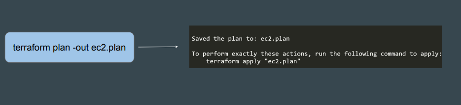
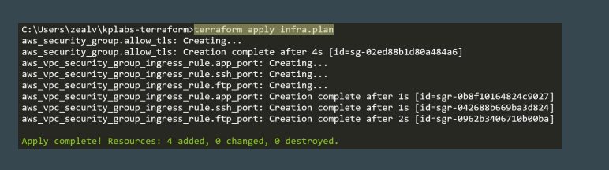
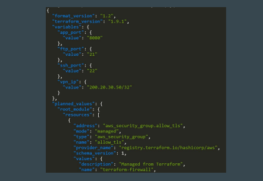
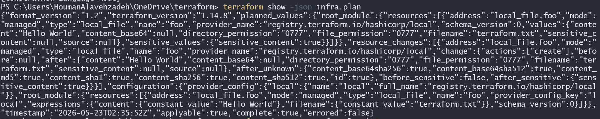
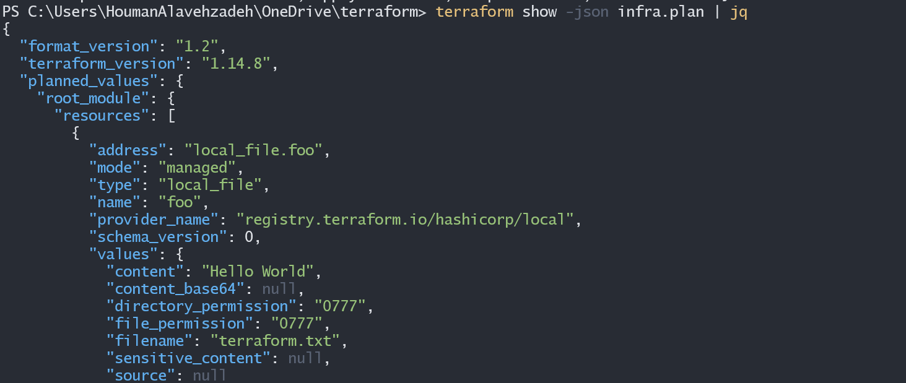

# Saving Terraform Plan to File

## Setting the Base

Terraform allows saving a plan to a file.

 <div align="center">
  
  </div>

## Apply from Plan File

You can run the terraform apply by referencing the plan file.
This ensures the infrastructure state remains exactly as shown in the plan to
ensure consistency

 <div align="center">
  
  </div>

## Use-Cases of Saving Plan to a File

Many organizations require documented proof of planned changes before
implementation.
These changes will further be reviewed and approved.
Running apply from plan ensures consistent desired outcome.

## Exploring Terraform Plan File

The saved Terraform plan file will be a binary file.
You can use the terraform show command to read the contents in detail.
you can also see output in json form (it is recommended  use "jq" for better output)

 <div align="center">
  
  </div>

## How to see file with plan extension in Json foramt?

the output file is binary and can not show in local machin,  in oreder see files inJson foramt use ;

 ```
 terraform show -json [filename].plan
 ```

</br>

<div align="center">
  
  </div>

 however the output result is not clean and hard to understand, to resolve this issue , you need to insatll jq application

### install jq

[Download and install Jq](https://jqlang.org/download/)

after you installed jq , use blow command;

```
terraform show -json [filename].plan | jq
```

and you see result is much cleaner than last time

<div align="center">
  
  </div>

## Use-Cases of Saving Plan to a File

Many organizations require documented proof of planned changes before
implementation.

These changes will further be reviewed and approved.

Running apply from plan ensures consistent desired outcome.
