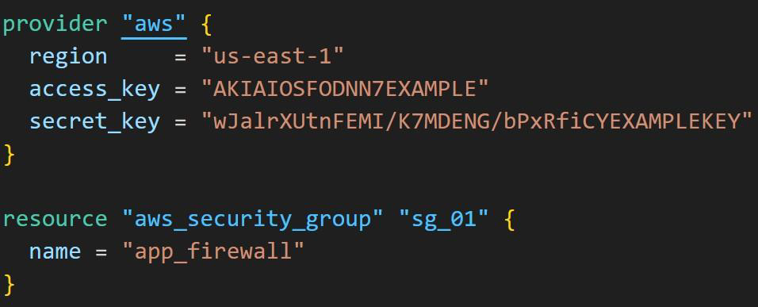
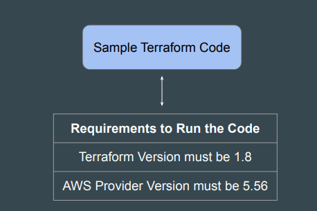
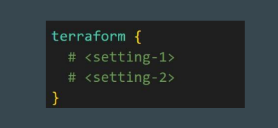
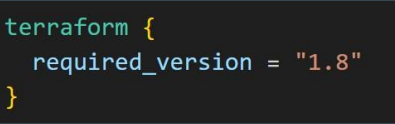
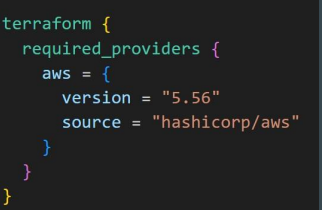
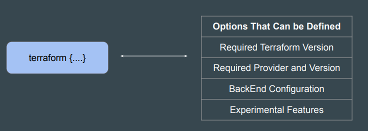

# Terraform setting

## Setting the Base

We can use the provider block to define various aspects of the provider, like
region, credentials and so on.

## Specific Version to Run Your Code

In a Terraform project, your code might require a very specific set of versions to
run.

## Introducing Terraform Settings

Terraform Settings are used to configure project-specific Terraform behaviors,
such as requiring a minimum Terraform version to apply to your configuration.

Terraform settings are gathered together into terraform blocks:

## 1 - Specifying a Required Terraform Version

If your code is compatible with specific versions of Terraform, you can use the
required_version block to add your constraints.

## 2 - Specifying Provider Requirements

The required_providers block can be used to specify all of the providers required
by your Terraform code.

You can further fine-tune to include a specific version of the provider plugins.

## Flexibility in Settings Block

There are a wide variety of options that can be specified in the Terraform block.

## Point to Note

It is a good practice to include the terraform { } block to include details like
required_providers as part of your project.

The provider { } block is still important to specify various other aspects like
regions, credentials, alias and others.

### Documentation Referenced

<https://registry.terraform.io/providers/hashicorp/aws/latest>

<https://developer.hashicorp.com/terraform/language/settings>
