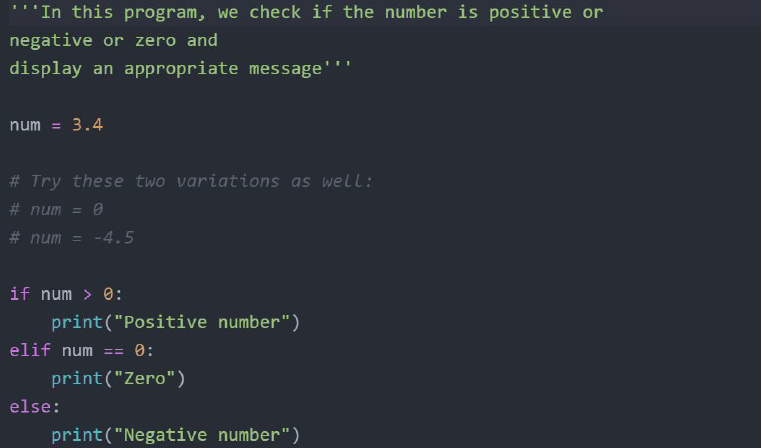

# Overview of Comments

A comment is a text note added to source code to provide explanatory information,
usually about the function of the code

  
  

## Comments in Terraform

The Terraform language supports three different syntaxes for comments:

| Type         | Description                                                                 |
|--------------|-----------------------------------------------------------------------------|
| #            | begins a single-line comment, ending at the end of the line.               |
| //           | also begins a single-line comment, as an alternative to #.                 |
| /*and*/    | are start and end delimiters for a comment that might span over multiple lines. |
