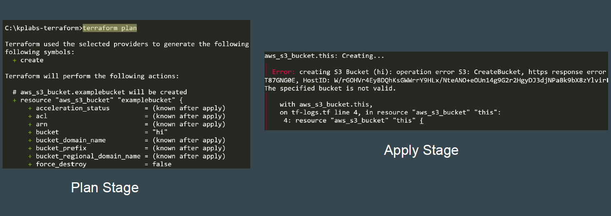
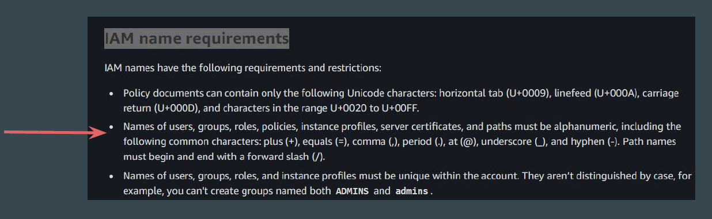
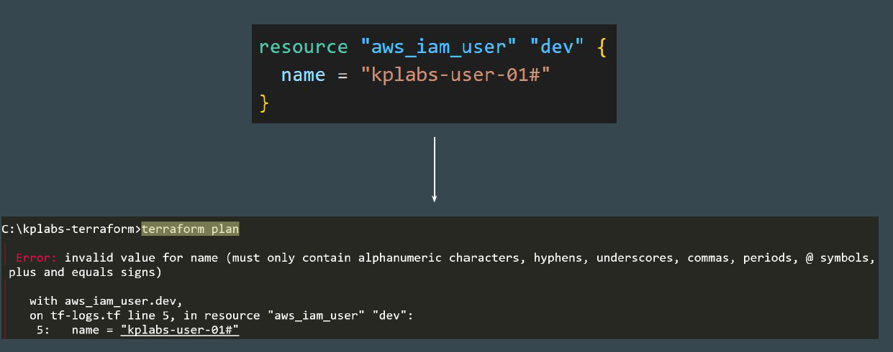
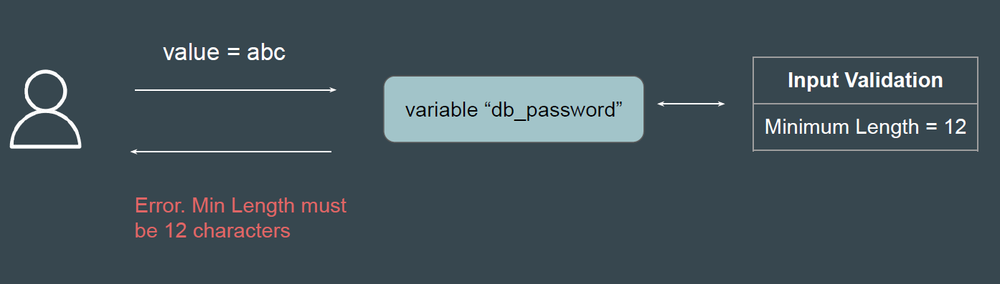
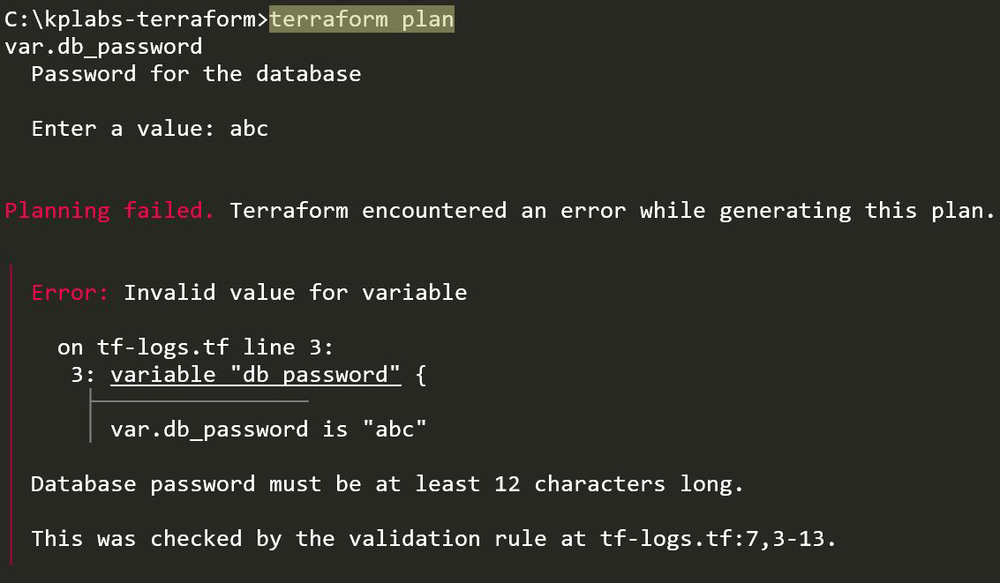

# Input Variable Validation

## Understanding the Challenge

Many times, the terraform plan would run properly without errors; however, as
soon as you run “terraform apply”, you get an error.

## Reason is Due to Lack of Validation

Every service has some restrictions and limits on aspects like naming
convention, capacity, etc.

## Terraform and Provider Validation

For many of the resources, Terraform and it’s associated providers will validate
the input so that any potential errors can be detected quickly.

## Terraform and Provider Validation

The provider-side validation works for many of the resources but NOT all of the
resources.

Hence, it is essential to have user-side validation to ensure consistency and
conformance to the standards.

## Input Variable Validation

The input variable validation feature allows you to enforce certain rules or
constraints on the values that can be assigned to input variables.

## Reference Screenshot

## Importance of Validation

It allows organizations to ensure consistency and adhere to organizational best
practices.

Allows organizations to make make your Terraform code more predictable.

Allows organizations to catch misconfigurations at an early stage, saving time
and potential infrastructure issues.

## Documentation Referenced

<https://registry.terraform.io/providers/hashicorp/aws/latest/docs/resources/s3_bucket>

<https://docs.aws.amazon.com/AmazonS3/latest/userguide/bucketnamingrules.html>
