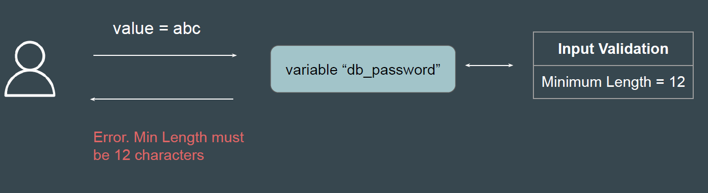
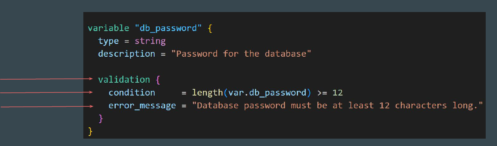
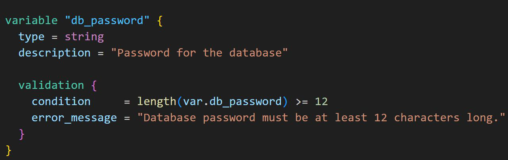

# Input Variable Validation - Practical

## Scenario To Consider for Practical

The value for “db_password” variable must be of minimum 12 characters length.
If user enters anything less than 12, Terraform should thrown an error.

## Understanding the Structure

There are three important components of input variable validation feature.
Validation Block, Condition, and Error Message

## Understanding Each Components

Validation block is used within a variable declaration to define one or more
conditions that the variable's value must satisfy.

Condition is a boolean expression that must evaluate to true for the validation to
pass.

The error message is a string that is displayed when the condition fails.

