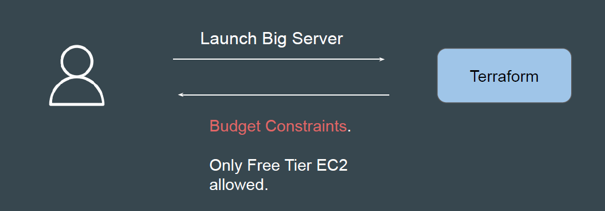
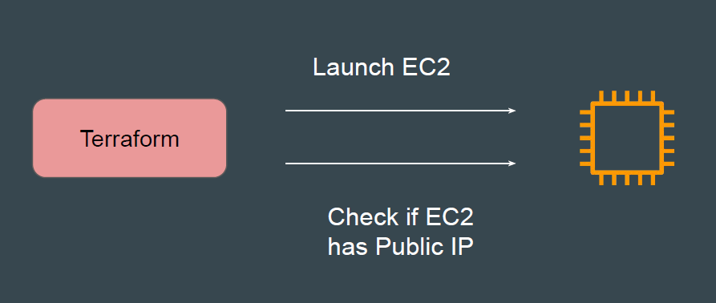
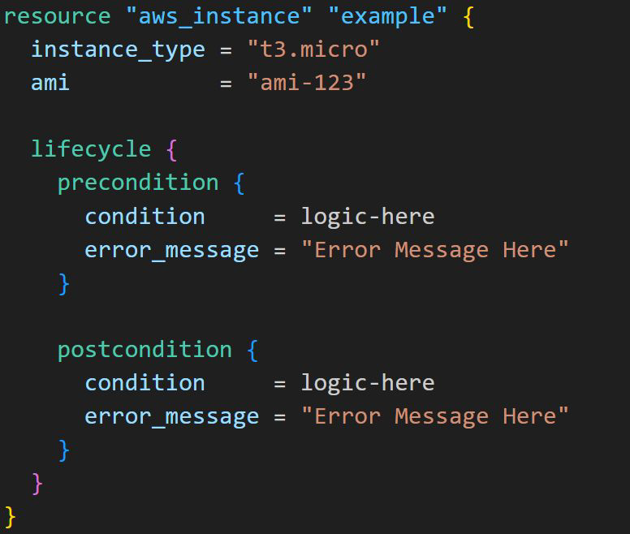

# Preconditions and Postconditions

## Introducing Pre-Conditions

Terraform preconditions are custom conditions that are checked BEFORE
evaluating the object they are associated with.

Example: Launch EC2 instance only if it is part of free tier

## Introducing Post-Conditions

Terraform postconditions are custom conditions that are checked AFTER
evaluating the object they are associated with.

Example: Verify if EC2 has Public IP address after it has been created.

## Overall Syntax

The precondition and postcondition are defined inside the lifecycle block.

## Point to Note

You can use the self object in postcondition blocks to refer to attributes of the
instance under evaluation.

Preconditions and postconditions are available in Terraform v1.2.0 and later.

Preconditions and Postconditions are supported for resources, data sources,
and outputs
