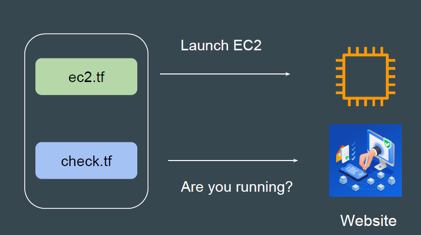
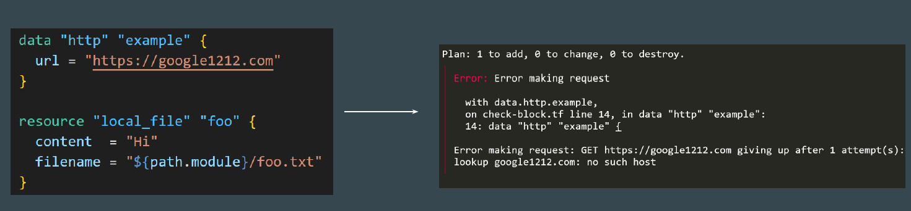
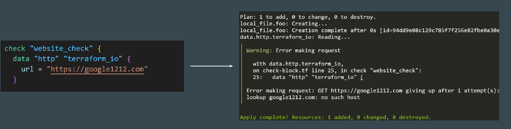
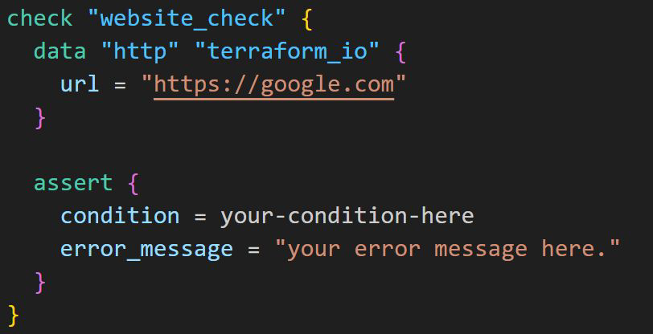
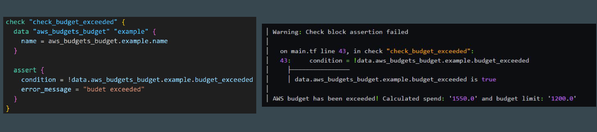
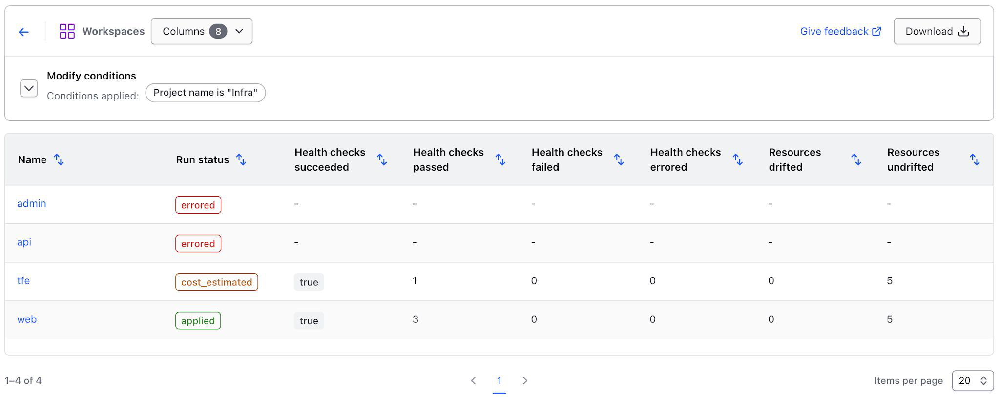

# Check Blocks

## Basics of Check Blocks

The check block can validate your infrastructure outside the usual resource
lifecycle.

## Using Data Source + Instance Block

In default configuration, if you use data source block for checking website along
with other resource block, if data block fails, Terraform will error out.

## Workflow of Check Block

Check block can include the nested data source block

If a scoped data source's provider raises any errors, they are masked as
warnings and do not prevent Terraform from continuing operation execution.

## Format of Check Block

Each check block must have at least one assert blocks.

Each assert block has a condition attribute and an error_message attribute.

## Point to Note - Check Blocks

Assertions do not affect Terraform's execution of an operation. A failed assertion
reports a warning without halting the ongoing operation.

This contrasts with other custom conditions, such as a postcondition, where
Terraform produces an error immediately, halting the operation and blocking the
application or planning of future resources.

## Sample Use-Case - AWS Budgets

Check the AWS Budget and warn if Budget has exceeded.

## Point to Note

Checks becomes more useful when they are regularly run in automation and can
alert us if they fail.

HCP Terraform can use check blocks to continuously monitor health and provide
notifications using continuous validation feature.

