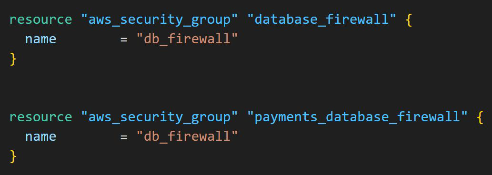
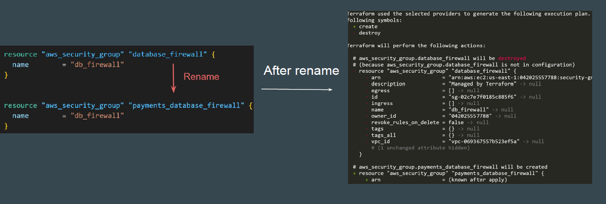
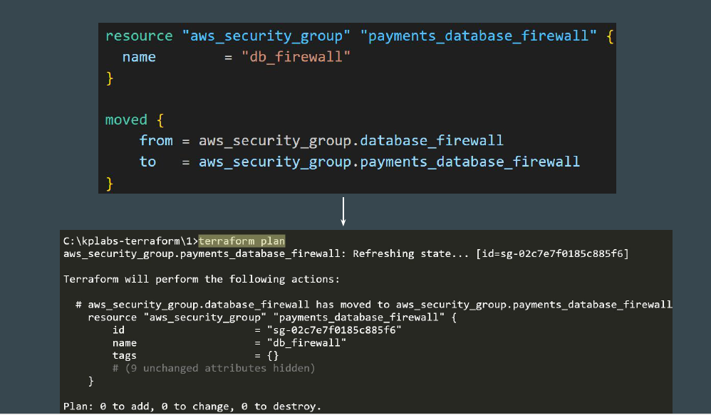
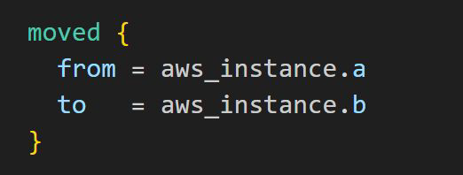

# Moved Blocks

## Setting the Base

In shared modules and long-lived configurations, you may eventually outgrow
your initial module structure and resource names.

## Understanding the Challenge

Terraform understands moving or renaming an object as an intent to destroy the
object at the old address and to create a new object at the new address.

## Introducing Moved Blocks

Using moved block, Terraform treats an existing object at the old address as if it
now belongs to the new address.

## Moved Block Syntax

A moved block expects no labels and contains only from and to arguments:

## Point to Note

Both terraform state mv and moved block allow us to achieve a similar set of use
cases.

One benefit of moved block is that the blocks are more visible for all team
members to know of.

terraform state mv can be used in more complex scenarios as it can also
support scripting for bulk operations.
