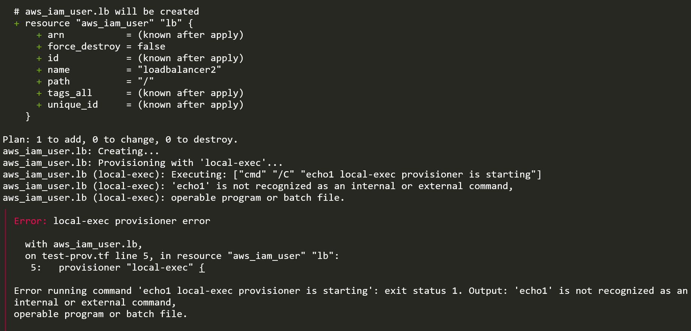
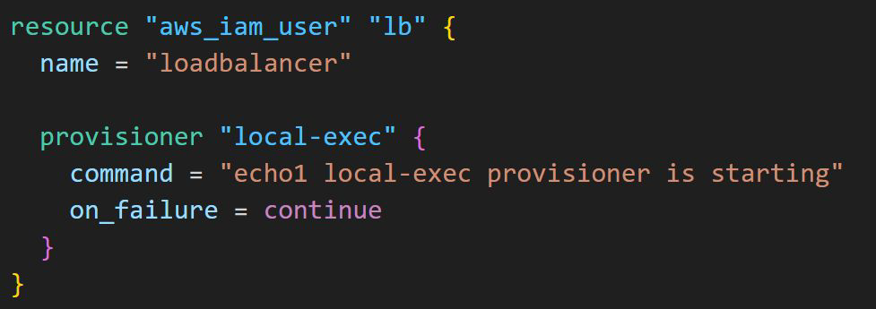
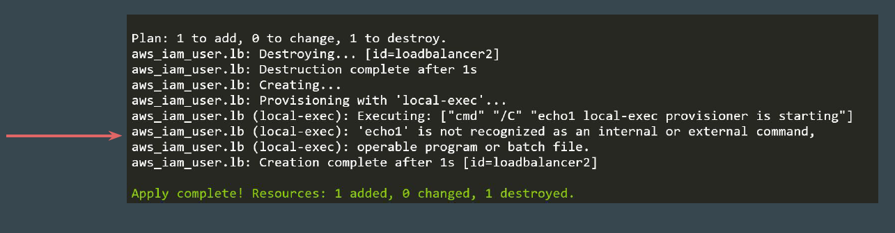

# Failure Behaviour in Provisioners

## Understanding the Challenge

By default, provisioners that fail will also cause the terraform apply itself to fail.
This will lead to resource being tainted and we have to re-create the resource.

## Basics of On Failure Setting

The on_failure setting can be used to change the default behaviour.

| Allowed Values | Description                                                                 |
|----------------|-----------------------------------------------------------------------------|
| continue       | Ignore the error and continue with creation or destruction.                |
| fail           | Raise an error and stop applying (default behavior). If this is a creation provisioner, taint the resource. |

## Reference Code - On-Failure

## Following screenshot shows that the provisioner has failed but still the apply has
completed successfully.
This is an example of on_failure = continue

