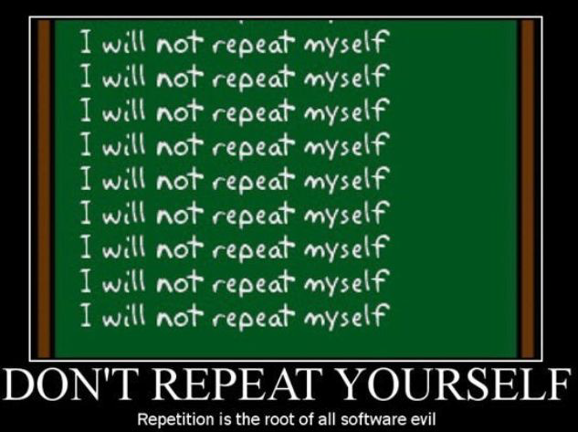
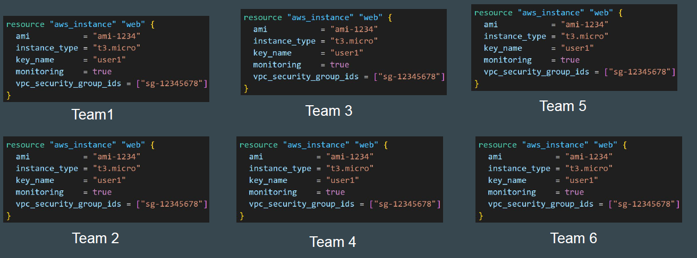
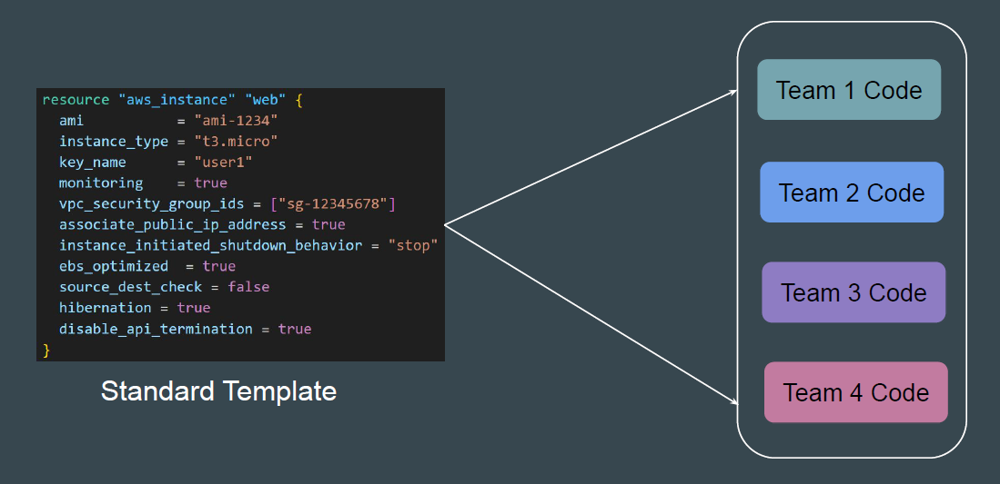
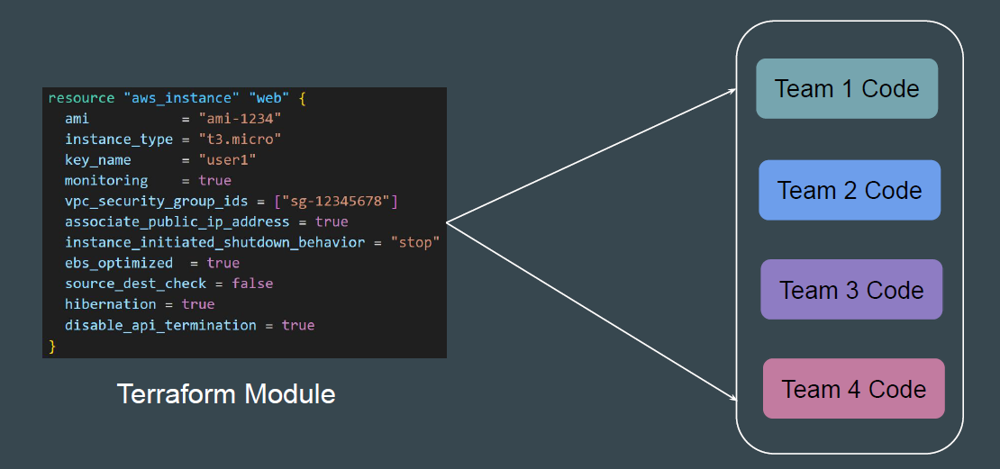
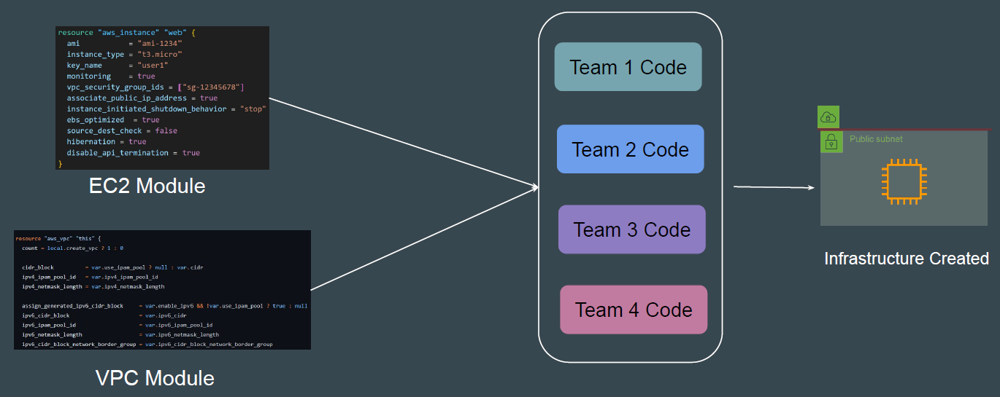

# Terraform Modules

In software engineering, don't repeat yourself (DRY) is a principle of software
development aimed at reducing repetition of software patterns.

## Understanding the Challenge

Let’s assume there are 10 teams in your organization using Terraform to create
and manage EC2 instances.

## Challenge with the Previous Example

- Repetition of Code.
- Change in AWS Provider specific option will require change in EC2 code
  blocks of all the teams.
- Lack of standardization.
- Difficult to manage.
- Difficult for developers to use.

## Better Approach

In this approach, the DevOps Team has defined standard EC2 template in a
central location that all can use.

## Introducing Terraform Modules

Terraform Modules allows us to centralize the resource configuration and it
makes it easier for multiple projects to re-use the Terraform code for projects.

## Multiple Modules for a Single Project

Instead of writing code from scratch, we can use multiple ready-made modules
available.

