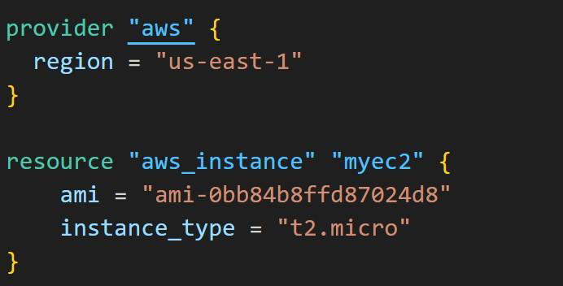
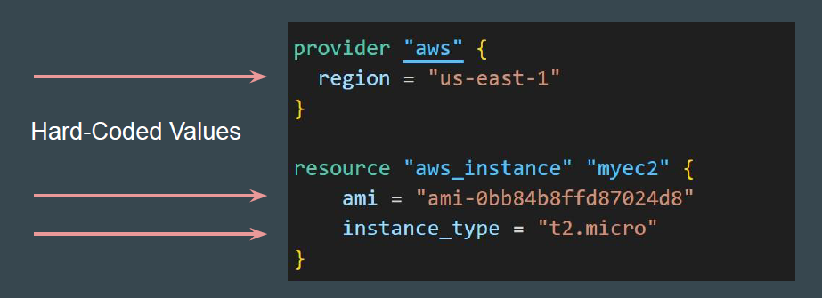
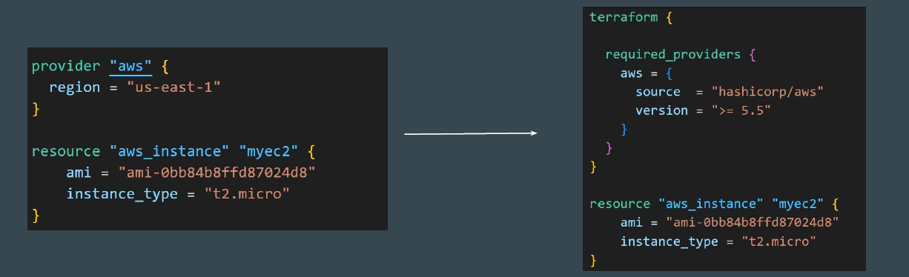

# Improvements in Custom Module Code

We had created a very simple module that allows developers to launch an EC2
instance when calling the module.

## Need to Analyze Shortcomings

Being a simplistic and a basic module code, there is a good room of
improvements.
In today’s video, we will be discussing about some of the important
shortcomings with the code.

## Challenge 1 - Hardcoded Values

The values are hardcoded as part of the module.
If developer is calling the module, he will have to stick with same values.
Developer will not be able to override the hardcoded values of the module.

## Challenge 2 - Provider Improvements

Avoid hard-coding region in the Module code as much as possible.

A required_provider block with version constraints for module to work is
important.

Documentation Referenced:

<https://developer.hashicorp.com/terraform/language/providers/requirements>

<https://registry.terraform.io/providers/hashicorp/aws/latest/docs>

## Root Module

Root Module resides in the main working directory of your Terraform
configuration. This is the entry point for your infrastructure definition.

## Child Module

A module that has been called by another module is often referred to as a child
module.

