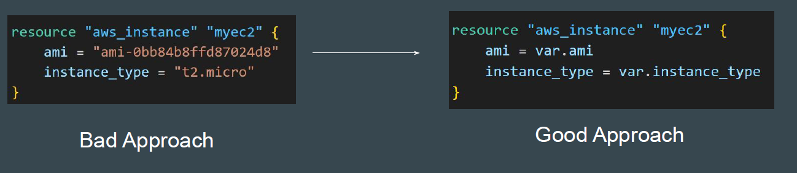
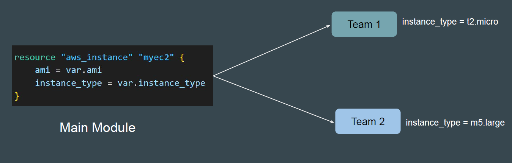
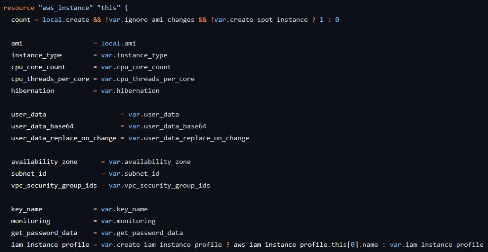

# Variables in Terraform Modules

## ## Point to Note

As much as possible, avoid hardcoding values as part of the Modules.
This will make the module less flexible.

## Convert Hard Coded Values to Variables

For modules, it is especially recommended to convert hard-coded values to
variables so that it can be overridden based on user requirements.

## Advantages of Variables in Module Code

Variable based approach will allow the teams to override the values.

## Reviewing Professional EC2 Module Code

Reviewing an EC2 Module code that is professionally written, we see that the
values associated with arguments are not hardcoded and variables are used
extensively.

