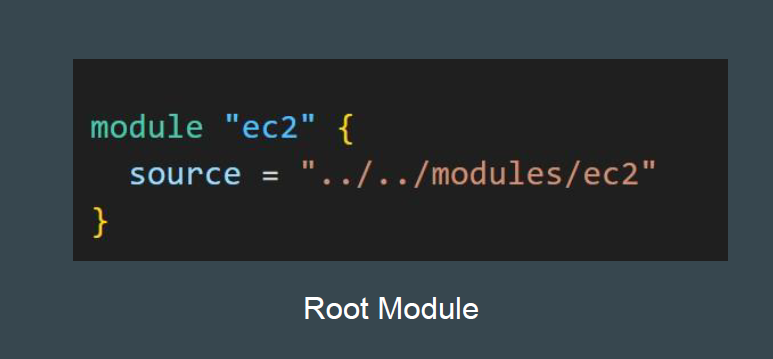
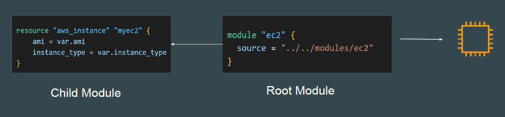

## Root Module and Child Module

Root Module resides in the main working directory of your Terraform
configuration.

This is the entry point for your infrastructure definition.

## Child Module

A module that has been called by another module is often referred to as a child
module.

