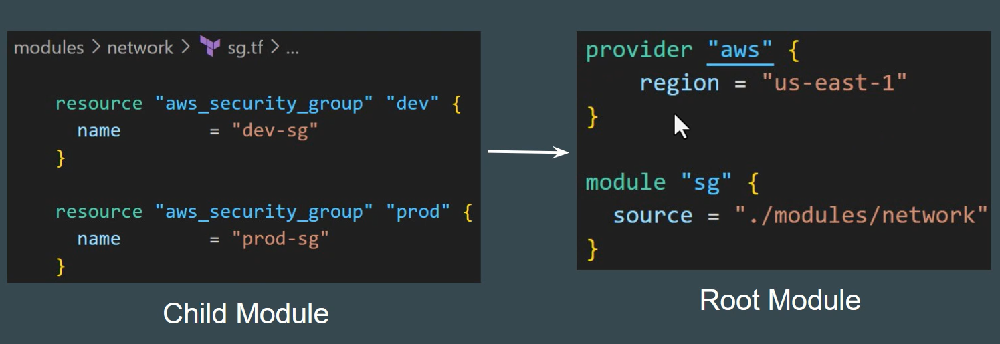
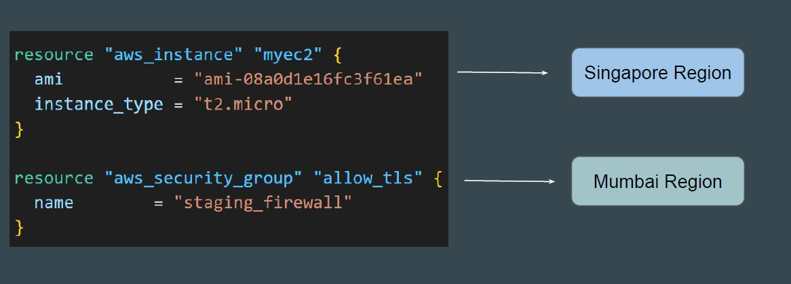
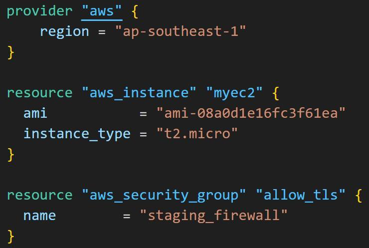
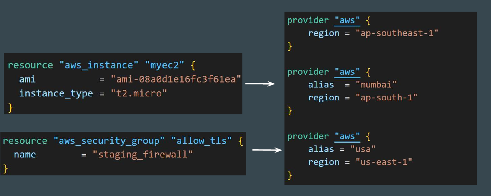
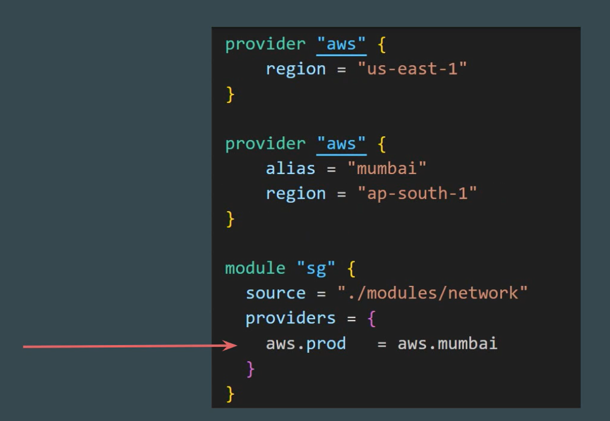
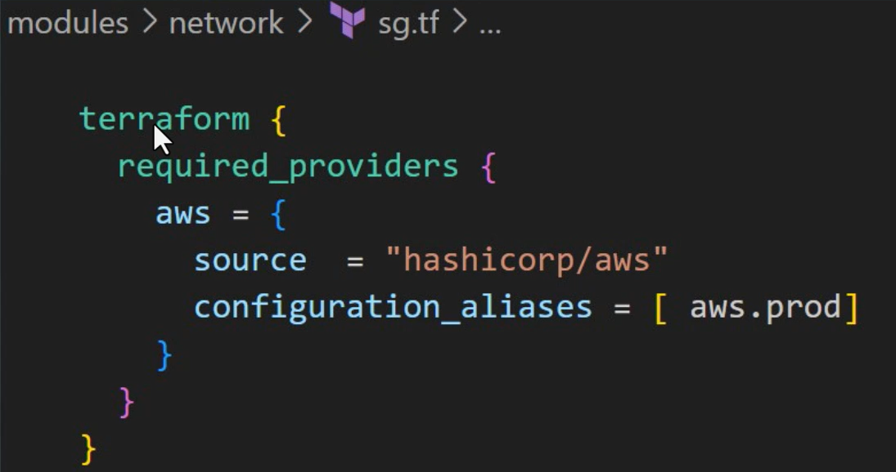
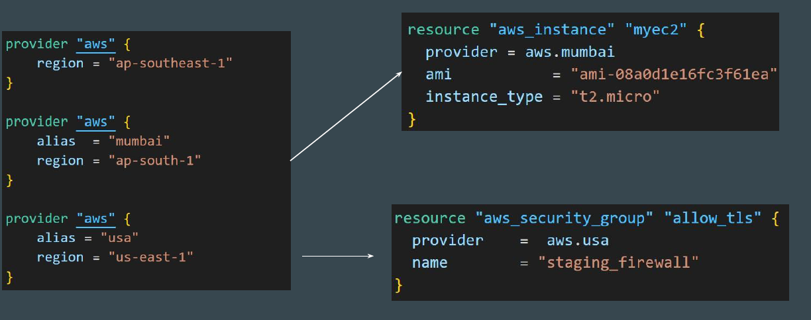

# Multiple Provider Configuration

## Stndard Single Provider Configuration

In a simple configuration, a child module automatically inherits default provider configuration from parent.

This means that explict provider blocks appear only in the root module, and child modules can simply decalre resources for that provider.

## Understanding the requirement

There can be a requirement that multiple resource types in the same TF file
need to be deployed in separate regions.

## Seeting the base

At this stage, we have been dealing with single-provider configuration.
In the below code, both resources will be created in Singapore region.

## Alias Meta-Argument

Each provider can have one default configuration, and any number of alternate
configurations that include an extra name segment (or "alias").

## Step 1- passing Providers Excplicity

you can use providers argument within a module block to expelicity define wich provider configuration are available to the child moudule.

## Step 2- Decalre Configuration Alias

In the child module, you need to also declare the configuration allias for the provider.

## Step 3- Use Provider Mete-Argument for Rsources

You can use Provider meta-arument whithin rescource to choose appropriate provider inforamtion.

## Final Output Using Alias

By using the provider meta-argument, you can select an alternate provider
configuration for a resource.

## Point to note

- The provisers arguments within a module block is similar to the provider argument within a resources, but is a map rather than a single string because a module may contain ressources from many diffrent providers.

- Providers configurations (those with the alias argument set) are never inherited automatically by child modules, and so must always be passwed explicitly using the providers map
