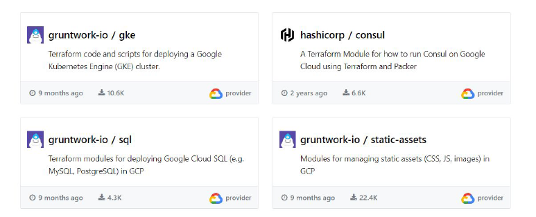
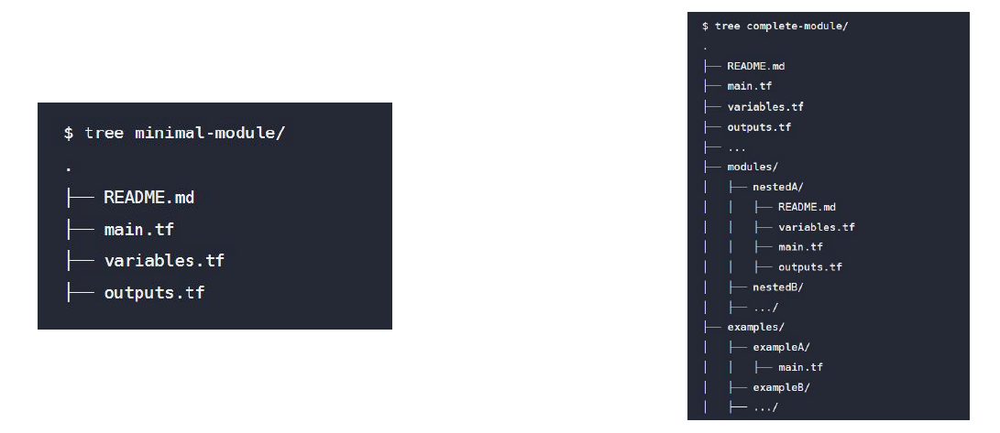

# Publishing Modules

## Overview of Publishing Modules

Anyone can publish and share modules on the Terraform Registry.

Published modules support versioning, automatically generate documentation, allow
browsing version histories, show examples and READMEs, and more.

## Requirements for Publishing Module

| Requirement | Description |
|-------------|-------------|
| GitHub | The module must be on GitHub and must be a public repo. This is only a requirement for the public registry. |
| Named | Module repositories must use this three-part name format `terraform-<PROVIDER>-<NAME>` |
| Repository description | The GitHub repository description is used to populate the short description of the module. |
| Standard module structure | The module must adhere to the standard module structure. |
| x.y.z tags for releases | The registry uses tags to identify module versions. Release tag names must be a semantic version, which can optionally be prefixed with a v. For example, v1.0.4 and 0.9.2 |

## Standard Module Structure

The standard module structure is a file and directory layout that is recommend for
reusable modules distributed in separate repositories.

