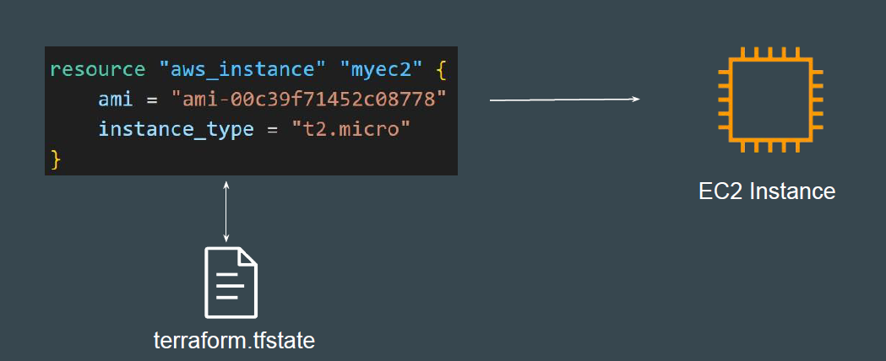
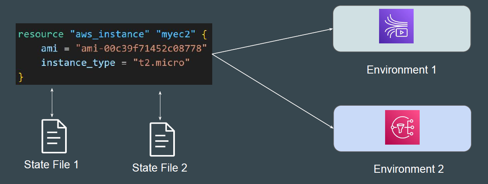
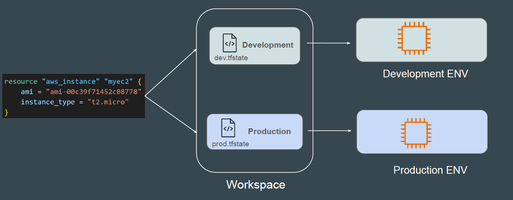
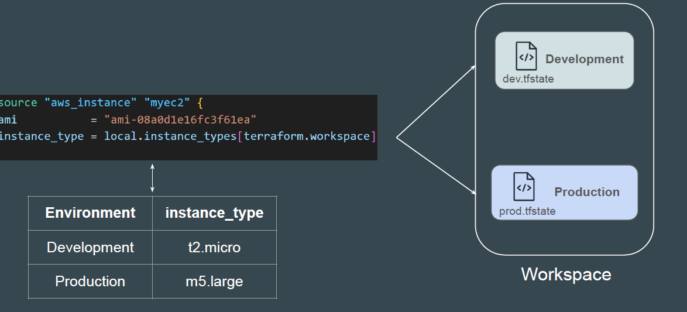

# Terraform Workspace

## Setting the Base

An infrastructure created through Terraform is tied to the underlying Terraform
configuration and a state file.

<div align="center">

</div>

## What If?

What if we have multiple state file for single Terraform configuration?
Can we manage different env’s through it separately?

<div align="center">

</div>

## Introducing Terraform Workspace

Terraform workspaces enable us to manage multiple set of deployments from
the same sets of configuration file.

<div align="center">

</div>

## Flexibility with Workspace

Depending on the workspace being used, the value to a specific argument in
your Terraform code can also change.

<div align="center">

</div>

## Terraform Workspace commands

```
terraform workspace
terraform workspace show
terraform workspace new dev
terraform workspace new prod
terraform workspace list
terraform workspace select dev

```
