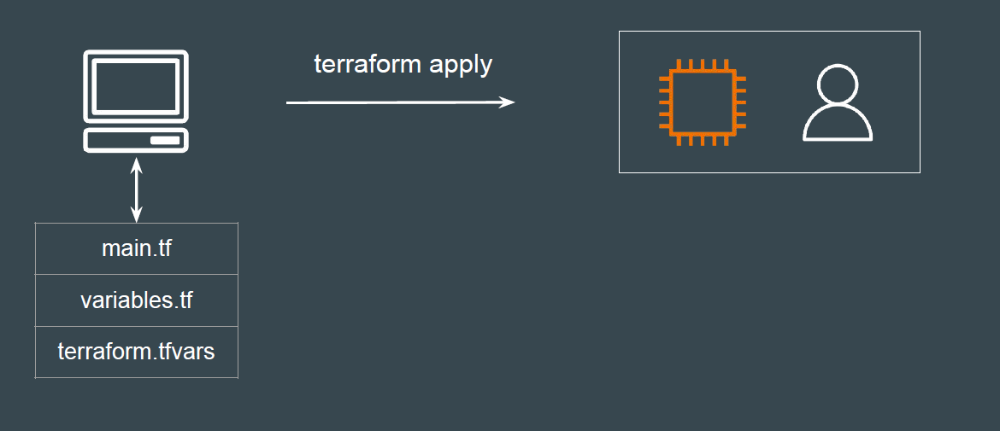
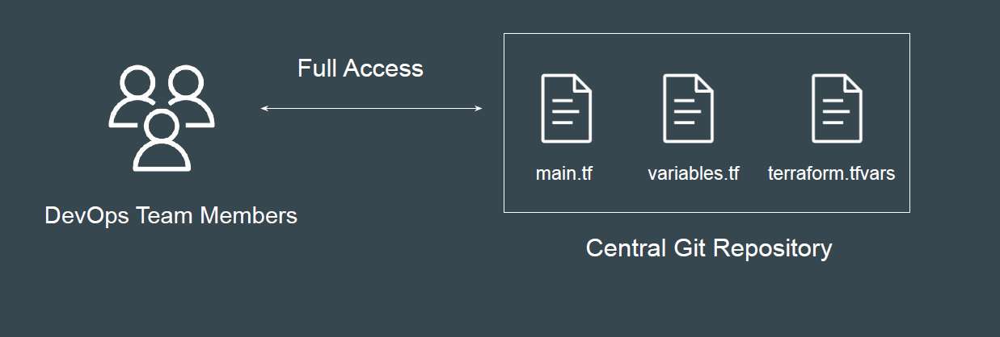
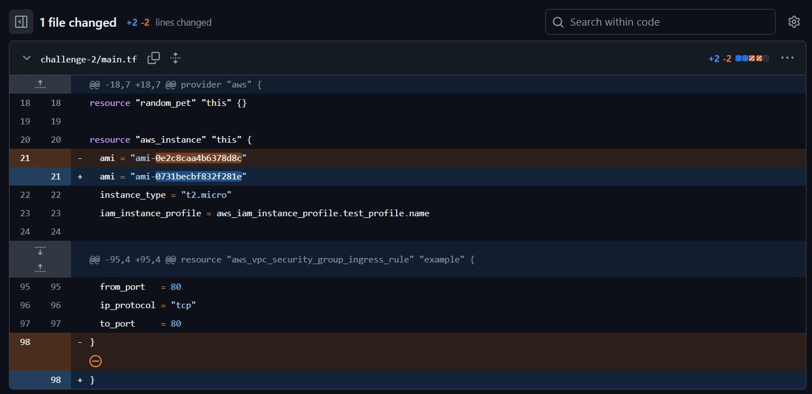
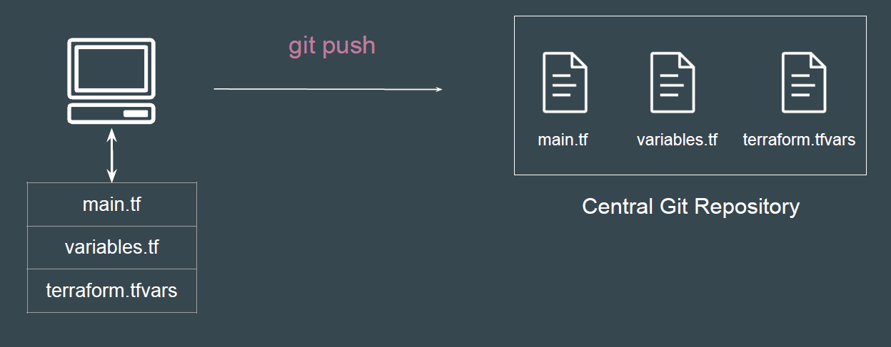
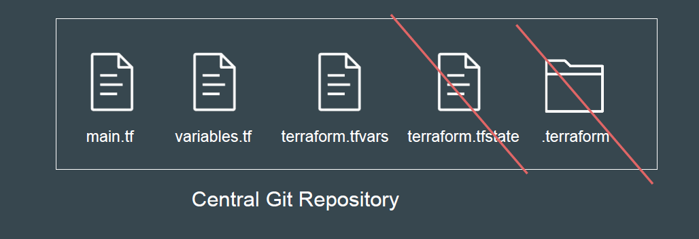

# Team Collaboration

## Local Changes are not always good

Until now, we’ve been working with Terraform code stored on our local
machines.

## Disadvantages of a Local-Only Approach

1. If your laptop fails, you risk losing both your Terraform code and, critically,
the state file.

2. Team collaboration is difficult—other members can’t access or update the
infrastructure code.

3. No versioning of changes is visible.

## ntegration with Git Repository - Essential

## Benefits of Git Repository

1. Centralized access for all team members

2. Full version history and change tracking

3. Code review and approval workflows

4. Integration with CI/CD for validation and plans

It is very important that all of your Terraform code is stored in a Git repository.
All DevOps Team members can have access to Git repository.

## ortant Step To-Do

Always commit and push your changes to the Git repository so all team
members see the latest updates.

## Point to Note - To be Discussed in Next Lectures

While it’s good practice to commit your Terraform code files to Git, you shouldn’t
commit every file.

terraform.tfstate file should NOT be added to your Git repository.
.terraform folder should NOT be added to your Git repository.

