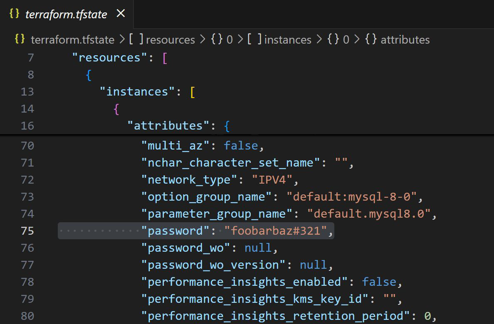

# Security Risks of Storing Terraform State Files in Git

## Setting the Base

Terraform State File (terraform.tfstate) can include secrets in plain text (e.g.,
passwords, tokens, etc)

## Why Not Commit to Git

Committing terraform.tfstate file to Git risks accidental exposure if the repository
is public, shared, or compromised, leading to data breaches.

</div
